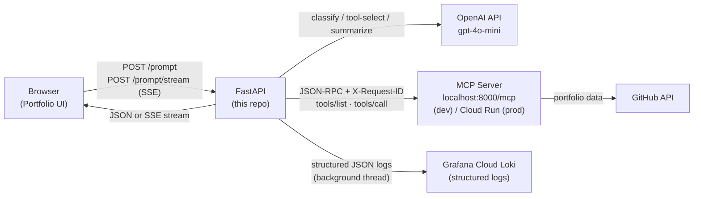
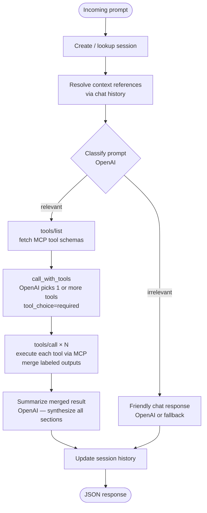
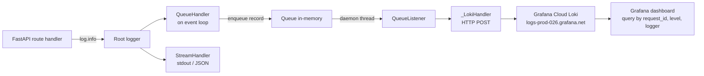
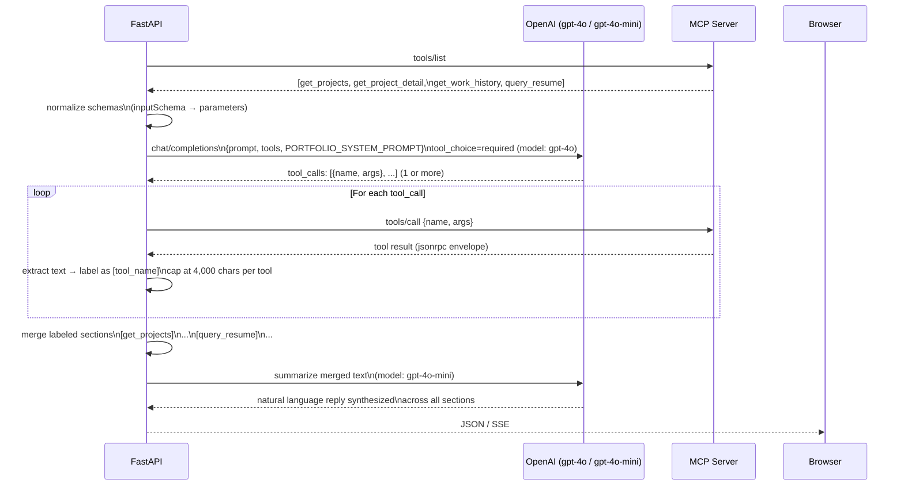
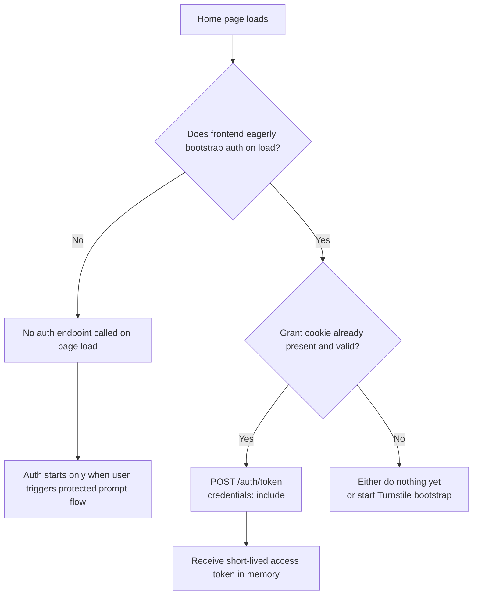
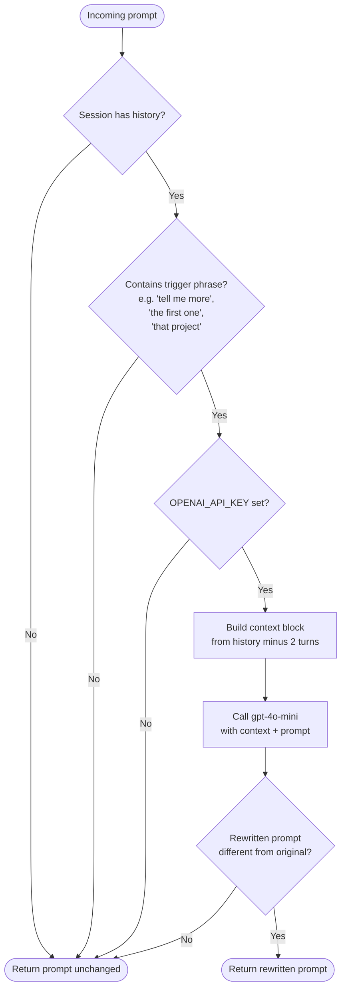
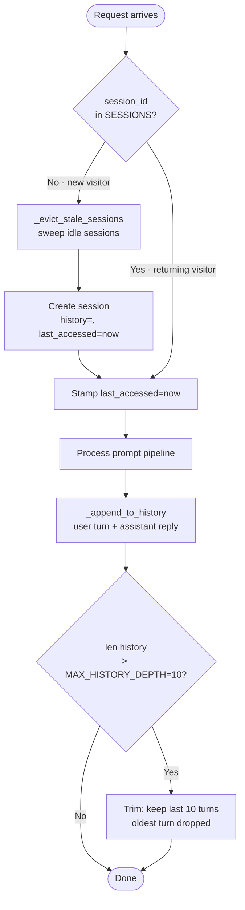

# Architecture

FastAPI backend for [yubikhadka.com](https://yubikhadka.com) — an LLM-powered terminal-style portfolio interface. The backend acts as an MCP client: it classifies visitor queries, delegates tool selection to the LLM, executes the chosen portfolio tool via MCP, and streams a natural-language response.

---

## High-Level System



---

## Responsibility Boundary

```
FastAPI                          MCP Server
────────────────────────────     ──────────────────────────────
Request handling                 Tool definitions
Session management               Tool execution
Relevance classification         GitHub API calls
LLM tool-selection call          Data aggregation
MCP transport (JSON-RPC)         (future) RAG / vector store
Response summarization
SSE streaming
Auth + rate limiting
```

**The key design principle:** FastAPI never decides which portfolio tool to call. It passes the user query and available tool schemas to the LLM. The LLM picks the tool. FastAPI executes it via MCP.

---

## Prompt Processing Pipeline

### JSON endpoint (`POST /prompt`)



### Streaming endpoint (`POST /prompt/stream`)

Same logical pipeline, emitting SSE frames at each phase so the frontend can progressively render.

```
SSE frame sequence:
  session → status:resolving_context → context
          → status:classifying → classification
          → status:mcp_routing  (tool/list + LLM tool-select + tools/call happen here)
          → status:summarizing → partial... → partial...
          → final → done
```

---

## Architectural Decisions

### 1. LLM decides tool selection — not FastAPI

**Problem:** The original FastAPI codebase used keyword heuristics (`if "project" in prompt → list_repositories`, `if "skills" in prompt → search_repositories`) to decide which MCP tool to call. These heuristics were fragile, missed edge cases, and required code changes every time the MCP tool surface changed.

**Decision:** FastAPI fetches tool schemas from MCP (`tools/list`), passes them to OpenAI's tool-calling API, and lets the LLM pick. FastAPI executes whichever tool the LLM selects via `tools/call`.

**Why it's better:** Intent understanding is what LLMs are good at. A question like "is Yubi a good fit for a senior backend role?" would never match a keyword heuristic but routes correctly to `query_resume` via the LLM.

---

### 2. `gpt-4o` for tool selection, `gpt-4o-mini` for everything else

**Problem:** `gpt-4o-mini` was used for all steps including tool selection. It made incorrect tool choices — e.g. routing "what AI technologies does Yubi use?" to `get_skills` (returns GitHub language breakdown) instead of `get_projects` (contains AI project context). It also failed to distinguish nuanced phrasing.

**Decision:** Tool selection uses `gpt-4o` (configured via `OPENAI_MODEL_TOOL_SELECTION`). Classification and summarization use `gpt-4o-mini` (simpler tasks, lower cost).

**Why it's better:** Tool selection is the highest-stakes decision in the pipeline — a wrong choice produces a useless or misleading answer. The cost of one extra `gpt-4o` call per request is justified by the accuracy gain.

---

### 3. `tools/list` response cached in-process

**Problem:** Fetching `tools/list` from the MCP server on every request adds latency and an unnecessary network call. The tool schemas don't change at runtime.

**Decision:** `state.MCP_TOOLS_CACHE` stores the result of the first `tools/list` call. Subsequent requests use the cache. The cache is cleared on `/mcp/reinitialize`.

**Why it's better:** Eliminates a redundant network round-trip on every prompt request.

---

### 3b. `tools/call` results cached for slow, stable tools

**Problem:** `get_projects` hits the GitHub API on every request and takes ~10s. For a portfolio site, the underlying data changes at most a few times a week. Every visitor asking "what projects has Yubi built?" paid the full GitHub roundtrip cost unnecessarily.

**Decision:** After a successful `tools/call`, results for `get_projects` and `get_work_history` are stored in `state.MCP_TOOL_RESULT_CACHE` keyed by tool name with a `cached_at` timestamp. On subsequent calls within the TTL (30 minutes), the cached result is returned immediately. The cache is cleared on `/mcp/reinitialize` for an immediate flush when new content is deployed.

Only argument-free, stable tools are cached (`_CACHEABLE_TOOLS = {"get_projects", "get_work_history"}`). Tools with variable arguments (`get_project_detail`, `query_resume`) are excluded — their responses depend on the input and would have near-zero cache hit rates.

Cache hits are surfaced in the response as `tools_cached: [...]` so the caller can see which tools were served from cache vs fetched fresh.

```
First request:   get_projects → GitHub API → ~10s → cache populated
Second request:  get_projects → cache hit  → ~0ms → same data
/mcp/reinitialize: cache cleared → next request fetches fresh
```

**Why it's better:** Eliminates the GitHub API roundtrip for the most common queries. Combined with the `tools/list` schema cache, the only remaining latency on a warm cache hit is the OpenAI calls (classify + tool select + summarize).

---

### 4. MCP response text extracted before summarization

**Problem:** The MCP server wraps tool results in a jsonrpc envelope (`{"jsonrpc": "2.0", "id": "...", "result": {"content": [{"type": "text", "text": "..."}]}}`). Passing this raw dict to the summarizer caused two issues: (1) the LLM received noise (jsonrpc metadata) alongside actual content, and (2) large responses (e.g. 80 projects) exceeded practical context limits, causing the summarizer to silently fall back to a raw string dump.

**Decision:** `_extract_mcp_text()` in `templates.py` pulls `result.content[].text` before building the summarize message, and caps output at 8,000 characters.

**Why it's better:** The summarizer receives clean, relevant text. Large payloads are safely truncated rather than silently degraded.

---

### 5. All prompt strings live in `templates.py`

**Problem:** Prompt strings were scattered across `openai_client.py` (inline in function bodies) and inconsistent between the JSON and SSE paths. The summarization prompt used in streaming differed from the one used in the JSON path, leading to different response quality depending on which endpoint was called.

**Decision:** All prompt constants (`CLASSIFY_SYSTEM_PROMPT`, `FRIENDLY_SYSTEM_PROMPT`, `PORTFOLIO_SYSTEM_PROMPT`, `_SUMMARIZE_SYSTEM`) live in `app/prompts/templates.py`. Both paths use `build_summarize_messages()` — a single source of truth.

**Why it's better:** Prompt changes are made in one place. JSON and SSE responses are guaranteed to be consistent.

---

### 6. Friendly chat path explicitly refuses to answer off-topic questions

**Problem:** `FRIENDLY_SYSTEM_PROMPT` said "politely redirect off-topic questions." The LLM interpreted this as "briefly answer, then redirect." For a question like "what is a RAG pipeline?", it answered with a wrong definition (Red-Amber-Green) before redirecting.

**Decision:** The prompt now explicitly says "do NOT answer the question" for off-topic queries — only acknowledge and redirect.

**Why it's better:** Prevents the assistant from hallucinating answers to general tech questions it has no business answering.

---

### 7. Summarizer handles empty MCP results without implying a technical error

**Problem:** When `get_project_detail` returned empty results for a non-existent project, the summarizer said "there was an issue retrieving information." This incorrectly implied a system failure when the real answer was "that project doesn't exist."

**Decision:** `_SUMMARIZE_SYSTEM` includes an explicit rule: if portfolio data is empty or null, state clearly that the item is not in the portfolio — do not attribute it to a retrieval error.

**Why it's better:** Honest, accurate responses. Visitors get a clear "not found" answer rather than a misleading error message.

---

### 8. JSON and SSE paths share business logic, not transport

**Problem:** `handle_prompt_json` and `stream_prompt_events` both contained identical implementations of context resolution, classification, MCP routing, and error handling — ~70 lines duplicated. Any change to business logic required updating two places.

**Decision:** Extract `_run_prompt_pipeline()` which runs steps 1–3 (context → classify → MCP) and returns a typed `_PromptPipelineResult` dataclass. Summarization is intentionally excluded from the shared function — JSON path blocks, SSE path streams tokens. Both handlers consume the same pipeline result but finalize the response their own way.

```
_run_prompt_pipeline()          ← shared: context, classify, MCP, error handling
      │
      ├── handle_prompt_json    ← blocking summarization → dict response
      └── stream_prompt_events  ← streaming summarization → SSE frames
```

**Why not fully unify summarization too?** Streaming summarization (token-by-token) is a material UX feature of the SSE path. Unifying it would require either dropping token streaming (regression) or introducing a complex callback/generator mechanism. The current boundary is the right one — business logic is shared, transport is separate.

**Why it's better:** Business logic changes happen in one place. `handle_prompt_json` is ~35 lines. SSE-specific code (framing, streaming) is the only thing left in `stream_prompt_events`.

---

### 9. Context resolver trigger list is deliberately narrow

**Problem:** The original trigger list included `"it"`, `"that"`, `"first"`, `"1st"` etc. These are common English words that appear in questions that have nothing to do with prior context — "what is yubi's first job?" fires the resolver unnecessarily, adding ~1s latency and an extra OpenAI call.

**Decision:** Only phrases that *unambiguously* signal a reference to something prior trigger the resolver: `"the first one"`, `"the second one"`, `"tell me more"`, `"that project"`, `"that role"`, `"expand on"`, etc. Single words are excluded entirely.

**Why it's better:** False positives are eliminated. The resolver only runs when it has a real job to do.

---

### 10. Context resolver uses `history[-2:]`, not `last_response`

**Problem:** The resolver only looked at `last_response` (the single most recent assistant reply). If the user pivoted topics between their reference and their follow-up, the resolver resolved against the wrong turn.

```
Turn 1: "what projects?" → matchcast, rag-pipeline, ...
Turn 2: "what skills?"   → JavaScript, Python, ...   ← last_response now points here
Turn 3: "tell me more about the first one"
         → resolver sees skills answer, not projects answer → resolves wrongly
```

**Decision:** Pass the last 2 full conversation turns (user + assistant) to the resolver instead of just `last_response`. The resolver has enough context to find the right referent even across a topic pivot.

**Why it's better:** Follow-up questions after a topic change resolve correctly. The 2-turn window is a pragmatic balance — enough context to be reliable, not so much that the resolver call becomes expensive.

---

### 11. Session history trimmed on write, not on read

**Problem:** History was sliced on read (`history[-2:]`, `history[-4:]`) but never trimmed on write. The list accumulated indefinitely in memory — wasted RAM that grew with every conversation turn across every active session.

**Decision:** `_append_to_history()` trims to `MAX_HISTORY_DEPTH` (default: 10 turns) immediately after appending. The stored list never exceeds the cap.

**Why it's better:** Memory usage per session is bounded regardless of conversation length. Consistent with how the data is actually used — only 2–4 turns are ever read, so storing more is pure waste.

---

### 12. Session TTL eviction is opportunistic, not scheduled

**Problem:** Sessions had no expiry. A session from a visitor 3 months ago would stay in memory forever.

**Decision:** Sessions stamp `last_accessed` on every touch. When a *new* session is created, `_evict_stale_sessions()` sweeps and removes any session idle longer than `SESSION_TTL_MINUTES` (default: 30 min). No background thread or scheduler required.

**Why it's better:** Memory is reclaimed without adding overhead to the hot path (existing session lookups). At portfolio-site traffic, new sessions arrive infrequently enough that the sweep cost is negligible.

---

### 13. Structured JSON logging with per-request correlation IDs

**Problem:** Default `logging.basicConfig` produces unstructured text lines — impossible to filter by request, correlate across FastAPI and MCP, or aggregate in a log management system. Debugging a specific slow request meant grepping for timestamps and hoping nothing else was logged in between.

**Decision:** Replace the text formatter with a structured JSON formatter. Every log line is a JSON object with fixed fields (`timestamp`, `level`, `logger`, `message`, `request_id`, `service`). A UUID `request_id` is generated at the start of each request, stored in a `contextvars.ContextVar`, and injected into every log record via a `logging.Filter`. The same `request_id` is forwarded as `X-Request-ID` on all outbound MCP calls and echoed back to the client in the response header.

```
Incoming request
  │  RequestIdMiddleware generates UUID → stored in request_id_var (ContextVar)
  │
  ├─ FastAPI log records ──→ RequestIdFilter reads request_id_var → injects into record
  │                                                                    ↓ JSON line
  └─ Outbound MCP call ───→ _mcp_headers() reads request_id_var → X-Request-ID header
                                                                    ↓ MCP server can log it
```

**Why ContextVar over thread-local:** FastAPI runs on asyncio. A single thread handles many requests concurrently — thread-local state would bleed across requests. `ContextVar` is bound to the async task (coroutine), so each request's `request_id` is fully isolated.

**Why it's better:** A single `request_id` makes it possible to grep/query all log lines for one request — across FastAPI startup, MCP calls, OpenAI calls, and summarization — in a single Loki query.

---

### 14. Loki log shipping via background QueueHandler, not inline HTTP

**Problem:** Shipping each log line to Grafana Cloud Loki over HTTP on the hot path would block every log call in the async event loop — adding hundreds of milliseconds of latency to each log statement.

**Decision:** A `QueueHandler` enqueues log records synchronously (in-memory, microseconds). A `QueueListener` runs in a background daemon thread and drains the queue, making the actual HTTP POST to Loki. Only the `QueueHandler` sits on the root logger — the blocking `_LokiHandler` never runs on the event loop.

The `RequestIdFilter` is attached to the `QueueHandler` (not the listener) — this is intentional. `request_id_var` must be read while still in the original async context. Once the record crosses the thread boundary into the listener, the ContextVar is no longer accessible.

```
Event loop (async)                 Daemon thread (background)
────────────────────               ──────────────────────────
log.info("msg")                    QueueListener drains queue
  → RequestIdFilter reads              → _LokiHandler.emit()
    request_id_var (in-context)            → HTTP POST /loki/api/v1/push
  → record.request_id = "abc..."
  → QueueHandler.enqueue(record)
  → returns immediately (~1µs)
```

**Loki wire format:** Each `emit()` call pushes a single stream entry. Labels are kept minimal (`service`, `level`, `logger`) so Grafana can filter efficiently. The log line itself is the full JSON object from `_JsonFormatter` — the same format as the console output, so local dev and Grafana Cloud always show identical data.

**Fallback:** If `GRAFANA_LOKI_URL`, `GRAFANA_LOKI_ORG_ID`, or `GRAFANA_LOKI_API_KEY` is not set, the `QueueHandler`/`QueueListener` stack is not created. Logs still go to stdout as structured JSON — zero-config for local dev.

**Why it's better:** Zero added latency on the request path. Log shipping is fully transparent to route handlers.

---

## Observability

### Structured log fields

Every log line (console and Loki) is a JSON object:

```json
{
  "timestamp": "2026-04-09T12:34:56",
  "level": "INFO",
  "logger": "app.services.mcp_client",
  "message": "MCP request completed: method=tools/call duration_ms=312",
  "request_id": "704a1fa2-7175-47d3-85df-553246423f8b",
  "service": "fastapi"
}
```

### Request correlation

Every inbound HTTP request gets a UUID `request_id`:

- Injected into **all FastAPI log records** for that request via `RequestIdFilter`
- Forwarded as `X-Request-ID` header on **all outbound MCP calls**
- Echoed back to the client as `X-Request-ID` in the response header

This makes it possible to trace one visitor's request through the full stack:

```
Grafana Loki query: {service="fastapi"} | json | request_id="704a1fa2-..."

→ Returns all log lines for that single request:
  [INFO]  MCP not initialized — attempting connection
  [INFO]  MCP initialized successfully
  [INFO]  MCP request: method=tools/list params={}
  [INFO]  MCP request completed: method=tools/list duration_ms=88
  [INFO]  MCP request: method=tools/call params={name=get_projects ...}
  [INFO]  MCP request completed: method=tools/call duration_ms=312
```

### Log shipping architecture



### Key log events to query in Grafana

| Event | Logger | What to look for |
|-------|--------|------------------|
| Slow MCP calls | `app.services.mcp_client` | `duration_ms > 1000` |
| Tool selection | `app.services.prompt_processing` | `tool_used` field |
| Classification | `app.services.openai_client` | `is_relevant` |
| Rate limit hits | `app.app` | `rate_limited` |
| MCP errors | `app.services.mcp_client` | `level=error` |
| Session eviction | `app.services.prompt_processing` | `evicted` |

### Env vars

| Var | Required | Description |
|-----|----------|-------------|
| `GRAFANA_LOKI_URL` | No | Loki push URL, e.g. `https://logs-prod-026.grafana.net` |
| `GRAFANA_LOKI_ORG_ID` | No | Numeric org/stack ID (the "User" field in Loki data source) |
| `GRAFANA_LOKI_API_KEY` | No | Service account token with `logs:write` (Logs Publisher role) |

All three must be set to enable shipping. Missing any one disables Loki (logs still go to stdout).

---

## MCP Tool Selection Flow

This is the core change from the previous architecture. FastAPI no longer contains routing heuristics — the LLM decides.



---

## Auth Bootstrap Flow

This is the current auth architecture for protecting expensive endpoints. The grant token is stored as an `HttpOnly` cookie; the short-lived access token stays in frontend memory and is sent in `Authorization`.

```mermaid
sequenceDiagram
    participant B as Browser UI
    participant FA as FastAPI
    participant CF as Cloudflare Turnstile

    Note over B,FA: Initial protected interaction with no valid grant cookie
    B->>CF: Solve challenge
    CF-->>B: turnstile_token
    B->>FA: POST /auth/session\n{turnstile_token}\ncredentials: include
    FA->>CF: Verify token
    CF-->>FA: OK
    FA-->>B: 200 + Set-Cookie grant_token\nHttpOnly; Secure; SameSite=None

    Note over B,FA: Silent access-token minting
    B->>FA: POST /auth/token\ncredentials: include
    Note right of FA: Reads grant_token from cookie
    FA-->>B: {access_token, expires_in}

    Note over B,FA: Protected expensive request
    B->>FA: POST /prompt or /prompt/stream\nAuthorization: Bearer access_token
    FA-->>B: JSON or SSE response
```

### Page-Load Behavior

Whether the home page hits auth endpoints depends on the frontend strategy, not the backend alone.



### 15. Parallel multi-tool calls — LLM may select more than one tool per query

**Problem:** Some questions are genuinely cross-domain. "Does Yubi have AI skills?" needs both `get_projects` (GitHub projects with AI tech stacks) and `query_resume` (workplace AI experience not on GitHub — e.g. Conor AI at FifthDomain). With a single-tool constraint, one source was always missing. The LLM defaulted to `get_projects`, which returned only public GitHub work and gave a misleading "GitHub only" answer.

**Decision:** OpenAI's `tool_choice="required"` allows the LLM to return multiple `tool_calls` in one response. `_process_with_mcp_tools` loops over all selected tools, executes each via MCP, extracts the text, and prefixes it with a label (`[get_projects]`, `[query_resume]`). The labeled outputs are concatenated into a single merged string passed to the summarizer.

Each tool's output is capped at `_PER_TOOL_MAX_CHARS = 4,000` characters before merging. Without the cap, a single large tool (e.g. `get_projects` returning 80 projects) fills the merged context and crowds out smaller tools — effectively undoing the multi-call.

**Fix required in summarizer:** Even with both tools returning relevant data, the summarizer initially only used `[get_projects]` and discarded `[query_resume]`. Root cause: the "err on the side of fewer results" rule in `_SUMMARIZE_SYSTEM` caused the LLM to anchor on the first large section and filter out the second. Fix: `_SUMMARIZE_SYSTEM` now explicitly instructs: *"Synthesize across ALL sections — do not ignore a section just because another section also has relevant data."*

```
Cross-domain query: "does yubi have AI skills?"

Single-tool (before)                 Multi-tool (after)
────────────────────────             ──────────────────────────────────────
LLM picks: get_projects              LLM picks: get_projects + query_resume
  → AI GitHub repos listed           → [get_projects]
                                          matchcast (GPT-4), rag-pipeline, ...
  Workplace AI experience missing    → [query_resume]
  (Conor AI never appears)               Conor AI at FifthDomain: LLM assistant
                                          for cybersecurity training (Lambda, SSE)
                                     → Summarizer synthesizes both sections
```

**Why it's better:** Cross-domain questions get complete answers. GitHub covers public projects; the resume covers workplace experience. Neither source alone is sufficient for capability questions.

---

### Before vs After

```
BEFORE (GitHub-era heuristics)
──────────────────────────────
User query
  → FastAPI keyword matching
      "list / projects" → list_repositories(type=owner, sort=updated)
      "tell me about X" → get_repository(owner=yubi00, repo=X)
      "search / find"   → search_repositories(q=user:yubi00 ...)
  → MCP executes whatever FastAPI decided

AFTER (LLM-driven tool selection)
──────────────────────────────────
User query
  → FastAPI fetches tool schemas from MCP
  → OpenAI picks tool based on intent
      "what projects has yubi built?" → get_projects()
      "tell me about Lambda-MCP"      → get_project_detail(project_name=...)
      "what tech skills does yubi have?" → get_projects() (stack per project)
      "where has yubi worked?"         → get_work_history()
  → FastAPI executes LLM's choice via MCP
```

---

## MCP Portfolio Tools

The MCP server exposes five portfolio-intent tools. FastAPI never calls these directly by name — the LLM selects the appropriate one.

| Tool | Description | Status |
|------|-------------|--------|
| `get_projects` | List all portfolio projects with descriptions, stack, stars, links | Live |
| `get_project_detail` | Deep dive on a specific project — README, language breakdown, stats | Live |
| `get_work_history` | Career timeline and role descriptions | Live (RAG) |
| `query_resume` | Answer background questions from resume knowledge base | Live (RAG) |

All live data is fetched from the GitHub API on demand inside the MCP server. Work history and resume data are served from a RAG pipeline.

---

## API Routes

| Method | Path | Auth | Description |
|--------|------|------|-------------|
| `GET` | `/` | — | Status / diagnostics |
| `POST` | `/prompt` | Optional | Non-streaming prompt response (JSON) |
| `POST` | `/prompt/stream` | Optional | Streaming prompt response (SSE) |
| `GET` | `/sessions/{session_id}` | `X-Session-ID` header | Session message history (in-memory); header must match path param |
| `POST` | `/auth/session` | — | Verify Turnstile → set grant-token cookie |
| `POST` | `/auth/token` | Grant-token cookie | Exchange for short-lived access token |
| `GET` | `/mcp/status` | Admin key | MCP connection status |
| `POST` | `/mcp/reinitialize` | Admin key | Force MCP reconnection |
| `GET` | `/mcp/ping` | Admin key | List tools from MCP server |

---

## Session Model

In-memory session store (no external dependency). Each session tracks:

```python
{
  "history": [
    {"user": "...", "assistant": "..."},
    ...
  ],
  "last_response": "..."   # used by smart_context_resolver
}
```

Sessions are lost on process restart. The context resolver uses `last_response` to rewrite follow-up questions before classification (e.g. "tell me more about the first one" → "tell me more about claude-agentic-rag-pipeline").

### How history is consumed

Different pipeline steps use different windows into `history`:

| Step | Window | Why |
|------|--------|-----|
| `build_summarize_messages` | last 2 turns | Summarizer only needs immediate prior context to avoid repetition |
| `call_with_tools` | last 4 turns (`_TOOL_CALL_HISTORY_WINDOW`) | Tool selection benefits from slightly wider context to handle follow-ups |
| `smart_context_resolver` | `last_response` only | Looks at what was just said to dereference "the first one", "that project", etc. |

---

## Context Resolution

`smart_context_resolver` runs before classification on every request. Its job is to rewrite ambiguous follow-up prompts into self-contained ones so the classifier and tool selector see a clear question rather than a dangling reference.

### How it works

```
1. Check if session has a last_response — if not, return prompt unchanged
2. Scan prompt for trigger words (ordinals, demonstratives)
3. If trigger found: call OpenAI with (last_response + prompt) → get rewritten prompt
4. Return rewritten prompt if different from original, else return original
```

### What it solves

Without context resolution, a follow-up like "tell me more about the first one" reaches the tool selector as-is. The tool selector has no awareness of what "the first one" refers to and either guesses wrong or makes a generic tool call. With resolution, it becomes "tell me more about matchcast" — a precise, answerable question.

### Known weaknesses (Phase 3 audit findings)

**1. Trigger keyword list is too broad**

Words like `"it"`, `"that"`, and `"first"` fire the extra OpenAI call even when no reference resolution is needed:
- "what is yubi's first job?" → triggers resolver (false positive — "first" is part of the question, not a reference)
- "is that true?" → triggers resolver (false positive — "that" refers to nothing in last_response)
- "tell me more about the first one" → triggers resolver correctly (true positive)

Every false positive adds ~1s latency and an unnecessary OpenAI call.

**2. Only resolves project references**

The resolver prompt explicitly says "rewrite using JUST the project name." If the user references a company ("tell me more about that role"), a skill ("how long has he used that?"), or anything non-project, the resolver either fails silently or produces a bad rewrite.

**3. Only looks at `last_response`, not `history`**

If the user asks a follow-up two or three turns after the original answer, `last_response` contains the most recent reply — which may not be the one the user is referencing. Example:

```
Turn 1: "what projects has yubi built?" → matchcast, claude-agentic-rag-pipeline, ...
Turn 2: "what skills does he have?" → JavaScript, Python, ...  (last_response updated)
Turn 3: "tell me more about the first one"  → user means matchcast, but last_response is now the skills answer
```

**4. Hardcoded model**

`gpt-4o-mini` is hardcoded rather than using `config.OPENAI_MODEL_DEFAULT`.

**5. History grows unbounded**

`session["history"]` is appended to on every turn with no cap. After 100 turns, the full history list is in memory even though only 2–4 turns are ever read. At scale across many concurrent sessions, this is a memory leak.

### Fixes implemented (Phase 3)

| Problem | Fix | Where |
|---------|-----|-------|
| Broad trigger keywords | Removed `"it"`, `"that"`, `"first"`, `"1st"` etc. Only unambiguous phrases remain: `"the first one"`, `"tell me more"`, `"that project"`, `"that role"`, `"expand on"`, etc. | `openai_client.py` |
| Project-only resolution | Resolver prompt now handles companies, roles, and skills — not just project names | `openai_client.py` |
| `last_response` only | Now passes `history[-2:]` (last 2 full turns) so topic pivots don't confuse the resolver | `openai_client.py` |
| Hardcoded model | Uses `config.OPENAI_MODEL_DEFAULT` | `openai_client.py` |
| Unbounded history | `_append_to_history()` trims to `MAX_HISTORY_DEPTH` on every write | `prompt_processing.py` |
| No session TTL | `_evict_stale_sessions()` clears sessions idle > `SESSION_TTL_MINUTES`; runs opportunistically on new session creation | `prompt_processing.py` |
| Scattered session init | `_get_or_create_session()` is the single place sessions are created; stamps `last_accessed` on every access | `prompt_processing.py` |

### Session memory management approach

**Scale decision:** In-memory store with a cap and lazy TTL eviction. No external dependency (no Redis). Correct for a portfolio site with low concurrent traffic. Sessions are lost on process restart — acceptable since visitors simply start a fresh conversation.

**Eviction strategy:** Opportunistic — stale sessions are swept when a *new* session is created, not on every request. This avoids adding overhead to the hot path while still bounding memory growth over time.

**Future path:** If sessions need to survive restarts or the site scales to multiple instances, replace `state.SESSIONS` with Upstash Redis (free tier, serverless, zero ops). The session interface (`_get_or_create_session`, `_append_to_history`) is the only surface that would need to change — the rest of the pipeline is unaffected.

### Context resolver flow



**Why the trigger gate matters:** Without it, every prompt containing "it", "that", or "first" would fire an extra OpenAI call — even questions like "what is yubi's first job?" where no reference resolution is needed. The narrow trigger list ensures the resolver only runs when it has a genuine job to do.

### Session memory lifecycle



### History window usage per pipeline step

Each step in the pipeline reads a different slice of history — wider windows for decisions that need more context, narrower for simpler tasks:

```
Incoming prompt
│
├─ smart_context_resolver  → history[-2:]   2 turns  resolve "the first one" → "matchcast"
│
├─ classify_prompt         → no history     —        is this relevant to Yubi's portfolio?
│
├─ call_with_tools         → history[-4:]   4 turns  LLM picks the right tool for follow-ups
│
└─ build_summarize_messages → history[-2:]  2 turns  avoid repeating what was just said
```

The stored history (up to 10 turns) is always larger than what any single step reads. Older turns act as a soft memory — they influence future turns indirectly through the cap/eviction cycle rather than being sent to the LLM directly.

---

## Security Layers

```
Incoming Request
      │
      ▼
┌─ Global Middleware (100 req/60s/IP) ─────────────────────┐
│  blocked → 429 JSON or SSE-shaped error                  │
└──────────────────────────────┬───────────────────────────┘
                               │
                               ▼
┌─ Route-Level Rate Limit ─────────────────────────────────┐
│  /prompt: 5/30s   /prompt/stream: 3/30s                  │
│  blocked → 429                                           │
└──────────────────────────────┬───────────────────────────┘
                               │
                               ▼
┌─ Auth Check (when REQUIRE_AUTH=true) ────────────────────┐
│  missing/invalid access token → 401                      │
└──────────────────────────────┬───────────────────────────┘
                               │
                               ▼
┌─ Streaming Concurrency Guard (stream only) ──────────────┐
│  max 1 active stream/IP → 429                            │
└──────────────────────────────┬───────────────────────────┘
                               │
                               ▼
                         Handle Request
```

Auth uses a short-lived access token in `Authorization` backed by a Cloudflare Turnstile human-verification step and an `HttpOnly` grant-token cookie. See the Auth section in [README.md](README.md) for the full flow.

---

## Code Structure

```
app/
├── app.py                  # App factory, middleware, router registration
├── config.py               # Env var loading and defaults
├── state.py                # In-memory state (sessions, MCP connection, token cache)
├── schemas.py              # Request/response models
├── logging_config.py       # Structured JSON formatter, Loki QueueHandler/QueueListener
├── utils.py                # SSE helper, timestamp
│
├── middleware/
│   └── request_context.py  # request_id_var (ContextVar), RequestIdFilter, RequestIdMiddleware
│
├── routes/
│   ├── prompt.py           # POST /prompt, POST /prompt/stream
│   ├── auth.py             # POST /auth/session (sets cookie), POST /auth/token
│   ├── mcp.py              # GET /mcp/status, POST /mcp/reinitialize, GET /mcp/ping
│   ├── sessions.py         # GET /sessions/{session_id}
│   └── root.py             # GET /
│
├── services/
│   ├── prompt_processing.py  # _run_prompt_pipeline (shared), stream_prompt_events, handle_prompt_json
│   │                         # _PromptPipelineResult dataclass, session helpers, MCP tool execution
│   ├── openai_client.py      # OpenAI calls: classify, call_with_tools, summarize, stream, context resolver
│   └── mcp_client.py         # MCP JSON-RPC transport, SSE parsing, Cloud Run auth, result validation
│
├── prompts/
│   └── templates.py          # All prompt strings: CLASSIFY, FRIENDLY, PORTFOLIO, summarize system
│                             # _extract_mcp_text: pulls text from MCP jsonrpc envelope, caps at 8k chars
│                             # build_summarize_messages: shared by JSON and SSE summarization paths
│
└── security/
    ├── auth_dependencies.py  # FastAPI dependencies for token enforcement
    ├── dependencies.py       # Rate limit dependencies
    ├── rate_limit.py         # In-memory fixed-window + concurrency limiters
    ├── tokens.py             # HMAC-signed JWT-like token mint/verify
    ├── policies.py           # Per-route rate limit constants
    ├── admin_auth.py         # Admin API key check for /mcp/* routes (constant-time comparison)
    └── sse.py                # SSE-shaped error responses
```
