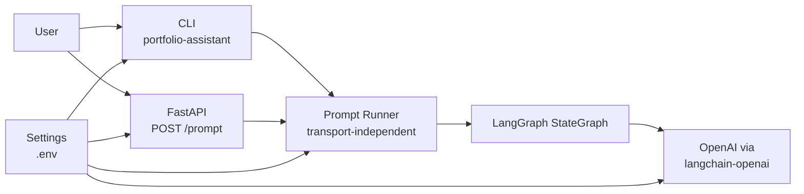
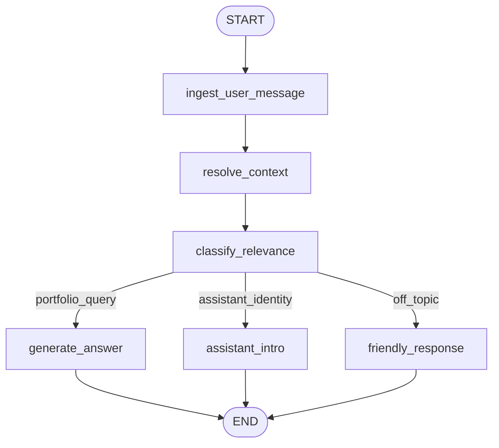

# LangGraph Portfolio Assistant Architecture

This document tracks the architecture of the learning implementation in this repository. It is intentionally separate from `ARCHITECTURE_OLD_SYSTEM.md`, which describes the existing production portfolio assistant.

The goal is to rebuild the portfolio assistant behavior with LangGraph while keeping production-grade boundaries: clear orchestration, explicit state, transport separation, configurable portfolio subject, grounded answers, and testable route decisions.

---

## Current Scope

Implemented phases:

- Phase 0: uv project, FastAPI app, CLI, env template, tests
- Phase 1: minimal LangGraph graph with context resolution, relevance classification, explicit routing, answer generation, assistant intro, and friendly redirect

Not implemented yet:

- GitHub retrieval
- resume/work-history retrieval
- multi-source context merge
- session memory/checkpointing
- streaming
- observability and reliability layers

---

## High-Level System



Key boundary: CLI and FastAPI are transports. They do not own assistant behavior. Both call the same `run_prompt()` service, which invokes the graph and shapes the response.

---

## Phase 1 Graph



### Route Categories

| Route | Meaning | Destination |
|---|---|---|
| `portfolio_query` | The user asks about the subject's projects, resume, work history, skills, contact details, or professional fit. | `generate_answer` |
| `assistant_identity` | The user asks who the assistant is or what it can do. | `assistant_intro` |
| `off_topic` | The user asks for general knowledge, coding/debugging help, or work on their own project. | `friendly_response` |

This route split exists because a boolean `is_relevant` flag was too coarse. For example, "who are you?" is not a portfolio data question, but it also should not receive the same response as "what is the weather?"

---

## State Model

`PortfolioState` is the shared graph state. Nodes return partial updates.

Current keys:

- `user_query`: raw user input after trimming
- `rewritten_query`: context-resolved query
- `messages`: optional prior conversation turns
- `assistant_subject`: configurable portfolio subject, such as `Yubi`
- `portfolio_context`: temporary Phase 1 grounding context
- `is_relevant`: compatibility boolean for answer-generation relevance
- `intent`: short classifier label, such as `projects`, `professional_fit`, `assistant_identity`, or `user_task`
- `route`: graph route category
- `final_answer`: final response text
- `error`: reserved for later reliability handling
- `node_trace`: append-only execution trace used for CLI/API debugging

Decision: keep state explicit and typed with `TypedDict`.

Problem solved: graph behavior is inspectable and each node has a clear input/output contract.

Trade-off: `TypedDict` does not validate data at runtime. We accept this for Phase 1 because LangGraph state updates are simple and tests cover route behavior. If state becomes more complex, we can add Pydantic validation at service boundaries.

---

## Module Boundaries

```text
app/
├── api/                 # HTTP transport only
├── cli.py               # CLI transport only
├── graph/               # LangGraph state, nodes, routing, builder
├── prompts/             # File-backed system prompts
├── services/            # LLM client, prompt runner, prompt rendering
├── config.py            # Environment settings
└── schemas.py           # API/CLI request and response models
```

### Responsibilities

| Module | Owns | Does not own |
|---|---|---|
| `app.api.prompt` | FastAPI route and HTTP exception mapping | graph wiring, prompt text, LLM calls |
| `app.cli` | argument parsing, interactive loop, terminal printing | graph wiring, prompt text, LLM calls |
| `app.services.prompt_runner` | transport-independent request-to-state mapping | HTTP, CLI, LLM prompt wording |
| `app.graph.builder` | graph topology | LLM details, transport details |
| `app.graph.nodes` | node adapters | prompt wording, OpenAI SDK calls |
| `app.services.openai_client` | OpenAI/LangChain integration | graph topology, HTTP/CLI transport |
| `app.services.prompt_templates` | prompt file loading and message construction | OpenAI invocation |
| `app.prompts/*.md` | prompt text | Python behavior |

Decision: isolate orchestration from model calls and transport.

Problem solved: each layer can change independently. For example, Phase 2 can add retrieval nodes without changing CLI argument parsing, and streaming can be added without duplicating graph logic.

Trade-off: more files than a small script. This is intentional because the project is meant to teach production-quality AI system structure.

---

## Architectural Decisions

### 1. Use Python, FastAPI, and LangGraph

Problem: the goal is to learn LangGraph while staying close to the existing Python production assistant.

Decision: build with Python, FastAPI, LangGraph, and `langchain-openai`.

Trade-off: this is not framework-minimal. The extra structure is justified because the project is explicitly about learning the LangChain/LangGraph ecosystem.

---

### 2. Add a CLI Transport Early

Problem: testing every change through a running API slows learning and creates unnecessary transport noise.

Decision: add `portfolio-assistant` CLI that invokes the same `run_prompt()` service as FastAPI.

Trade-off: one extra transport to maintain. The shared runner keeps the cost low and catches transport-independent bugs quickly.

---

### 3. Keep the Assistant Generic

Problem: the original docs mention Yubi, but a reusable portfolio assistant should work for any subject.

Decision: make `ASSISTANT_SUBJECT`, `PORTFOLIO_CONTEXT`, `GITHUB_OWNER`, and `GITHUB_TOKEN` configuration-driven.

Trade-off: generic wording can be less personal until profile data is supplied. Later phases should introduce a profile document containing preferred name, pronouns, summary, resume, and tone preferences.

---

### 4. Use Explicit Route Categories Instead of Boolean Relevance Only

Problem: a boolean classifier cannot distinguish "who are you?" from genuine off-topic prompts, and it can let user-task prompts through if they mention technologies in the subject's stack.

Decision: classify into `portfolio_query`, `assistant_identity`, and `off_topic`, while retaining `is_relevant` as a compatibility flag for answer generation.

Problem solved: route behavior is transparent and testable.

Trade-off: route taxonomy needs to be maintained as the assistant grows. This is manageable because route names are centralized in `RouteName`.

---

### 5. Refuse User Coding/Debugging Tasks

Problem: prompts like "fix my TypeScript bug" can be confused with portfolio relevance because TypeScript may be in the subject's stack.

Decision: classify user-task requests as `off_topic` unless the user asks about the portfolio subject's ability or experience.

Problem solved: the assistant stays within the portfolio boundary and avoids becoming a general coding assistant.

Trade-off: users may expect help because the subject has those skills. The redirect explains the boundary and offers portfolio-related alternatives.

---

### 6. Keep Prompt Text in Dedicated Files

Problem: inline prompt strings grow hard to scan, review, and compare across phases.

Decision: store system prompts under `app/prompts/` and keep Python responsible only for loading and rendering messages.

Problem solved: prompt iteration becomes easier and prompt changes are reviewable as content changes.

Trade-off: file I/O is introduced at prompt load time. Prompts are cached with `lru_cache`, so runtime overhead is negligible.

---

### 7. Ground Phase 1 Answers in Supplied Context

Problem: without retrieval, the assistant has no factual portfolio data.

Decision: `generate_answer` may only answer from `PORTFOLIO_CONTEXT` or per-request `--context`; otherwise it must say there is not enough data.

Problem solved: no hallucinated portfolio details before retrieval exists.

Trade-off: early answers are limited. This is acceptable because Phase 2/3 will add structured retrieval.

---

### 8. Use Tests for Graph Route Behavior

Problem: LLM behavior can drift, but graph topology and route handling should remain deterministic.

Decision: test graph routing with a fake assistant service and reserve real OpenAI calls for smoke checks.

Problem solved: route regressions are caught quickly without requiring API keys in CI.

Trade-off: fake-service tests do not prove prompt quality. We supplement with manual CLI checks during development.

---

## Current Runtime Examples

Assistant identity:

```powershell
uv run portfolio-assistant "who are you" --show-trace
```

Expected trace:

```text
ingest_user_message -> resolve_context -> classify_relevance -> assistant_intro
```

User-task redirect:

```powershell
uv run portfolio-assistant "can you help me fix bug in one of my typescript project" --show-trace
```

Expected trace:

```text
ingest_user_message -> resolve_context -> classify_relevance -> friendly_response
```

Portfolio-fit answer:

```powershell
uv run portfolio-assistant "can Yubi help with TypeScript backend systems?" --subject "Yubi" --context "..."
```

Expected trace:

```text
ingest_user_message -> resolve_context -> classify_relevance -> generate_answer
```

---

## Future Architecture Updates

This document should be updated whenever a phase changes system behavior. Expected next updates:

- Phase 2: retrieval planning and source category routing
- Phase 3: GitHub, resume, and document retrieval nodes
- Phase 4: context merge, scoring, dedupe, and context budget policy
- Phase 6: memory and checkpointing strategy
- Phase 8: streaming transport and event contract
- Phase 9: logging, tracing, and LangSmith decisions
- Phase 10: retries, fallbacks, timeout policy, and partial answers
