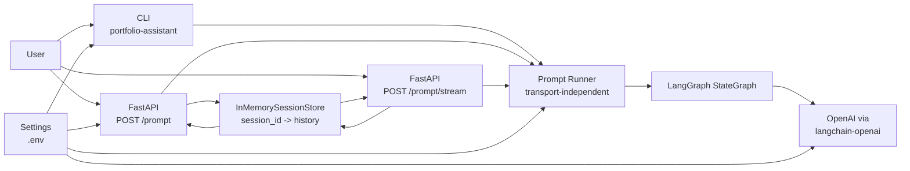
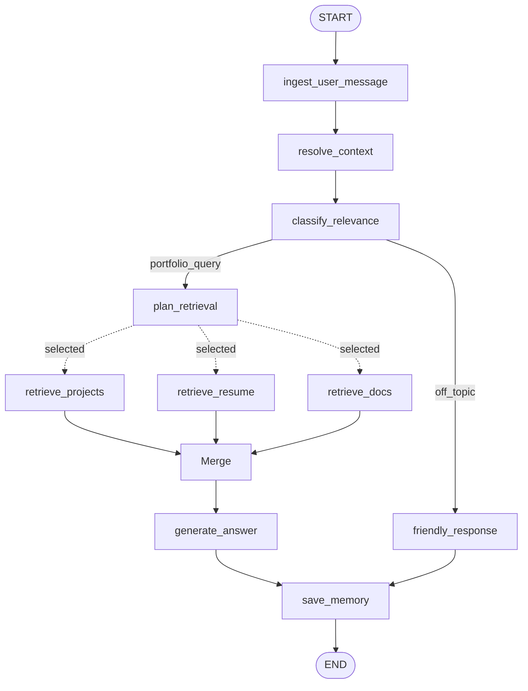

# LangGraph Portfolio Assistant Architecture

This document tracks the architecture of this LangGraph portfolio assistant.

The goal is to provide production-grade boundaries: clear orchestration, explicit state, transport separation, configurable portfolio subject, grounded answers, and testable route decisions.

---

## Current Scope

Implemented phases:

- Phase 0: uv project, FastAPI app, CLI, env template, tests
- Phase 1: minimal LangGraph graph with context resolution, relevance classification, explicit routing, answer generation, and friendly redirect
- Phase 2: retrieval planning with explicit source categories and debug-visible planned sources
- Phase 3A: retrieval nodes, GitHub project retrieval, local resume/docs retrieval, and context merging
- Phase 6A/B: API session contract, app-level session store, explicit `save_memory` graph step, and checkpointer evaluation
- Phase 8A: SSE streaming route reusing the existing prompt runner and graph-level answer-token streaming

Not implemented yet:

- PDF/DOCX resume ingestion
- vector/RAG-backed resume retrieval
- external observability layers
- advanced reliability layers

---

## High-Level System



Key boundary: CLI and FastAPI are transports. They do not own assistant behavior. Both call the same `run_prompt()` service, which invokes the graph and shapes the response.

The streaming route keeps this boundary intact: SSE framing stays in `app.api.prompt`, while orchestration and answer generation remain in the shared prompt runner and graph-backed services.

---

## Current Graph



### Route Categories

| Route | Meaning | Destination |
|---|---|---|
| `portfolio_query` | The user asks about the subject's projects, resume, work history, skills, contact details, self-introduction, or professional fit. | `plan_retrieval` |
| `off_topic` | The user asks for general knowledge, coding/debugging help, or work on their own project. | `friendly_response` |

This route split exists because a boolean `is_relevant` flag was too coarse. Portfolio identity questions such as "who are you?" now flow through the normal portfolio retrieval path, while only genuinely unrelated prompts go to `off_topic`.

### Retrieval Sources

Phase 2 added source planning. Phase 3A adds source retrieval and context merging.

| Source | Meaning |
|---|---|
| `projects` | GitHub or portfolio projects, READMEs, stacks, outcomes, and links |
| `resume` | Resume facts, employment timeline, companies, responsibilities, education, certifications, skills, achievements, and role summaries |
| `docs` | Long-form documents, case studies, blog posts, notes, or custom knowledge |

Decision: keep source planning separate from source execution.

Problem solved: the graph now makes information needs explicit before retrieval exists. Phase 3 can add retrieval nodes without changing classification or answer-generation policy.

Trade-off: Phase 2 adds an extra LLM call for relevant queries before retrieval execution. This is acceptable for inspection and correctness; later we can optimize or combine calls if latency becomes a problem.

### Retrieval Execution

The first retrieval implementation uses:

- GitHub REST API for `projects`; forks are excluded by default for "built projects" accuracy
- local text/markdown files for `resume` and `docs`

The graph dispatches only planned retrieval sources with LangGraph dynamic sends. Independent retrieval nodes can run concurrently, then join at `merge_normalize_context`.

Decision: use conditional fan-out for retrieval execution.

Problem solved: multi-source retrieval avoids unnecessary sequential latency and traces only show selected retrieval nodes.

Trade-off: fan-out introduces more graph-routing complexity and retrieval node ordering in traces should not be treated as semantically meaningful.

Project retrieval strategy:

- Current: fetch recent GitHub repositories for `GITHUB_OWNER`, excluding forks unless `GITHUB_INCLUDE_FORKS=true`.
- Later: enrich project detail with README content, pinned/featured project configuration, scoring, and cache policy.

Problem solved: "what projects has this person built?" should not treat forked repositories as owned work.

Trade-off: excluding forks may hide meaningful fork-based contributions. A future contribution-focused query can use a separate retrieval mode or include forks conditionally.

Resume strategy:

- Current: load a small resume source automatically from `data/resume.md` or `data/resume.pdf`. Work-experience questions use the `resume` source because a normal 1-2 page resume already contains the experience section.
- CLI still supports `--resume-path` as a one-off override for local testing.
- PDF resumes can be loaded directly, and the existing `scripts/convert_resume_pdf.py` helper remains available when Markdown inspection is useful.
- Later: accept PDF/DOCX, normalize into Markdown/JSON during ingestion, then optionally chunk/index for RAG.

Problem solved: local setup no longer requires passing a resume path on every API call, and a 1-2 page resume still fits comfortably in context so RAG is not required for the first useful version.

Trade-off: direct context loading is simpler but less scalable for larger document collections. RAG remains a later upgrade, not a Phase 3 blocker.

---

## State Model

`PortfolioState` is the shared graph state. Nodes return partial updates.

Current keys:

- `user_query`: raw user input after trimming
- `rewritten_query`: context-resolved query
- `messages`: optional prior conversation turns
- `assistant_subject`: configurable portfolio subject, such as `Yubi`
- `portfolio_context`: optional ad-hoc per-request context for manual testing
- `resume_path`: optional per-request resume text/Markdown path
- `is_relevant`: compatibility boolean for answer-generation relevance
- `intent`: short classifier label, such as `projects`, `professional_fit`, `profile`, or `user_task`
- `route`: graph route category
- `retrieval_sources`: planned source categories for portfolio queries
- `retrieval_reason`: short explanation of why those sources were selected
- `project_context`, `resume_context`, `docs_context`: raw retrieved source context
- `merged_context`: normalized context passed to answer generation
- `retrieval_errors`: non-fatal retrieval errors collected from source nodes
- `final_answer`: final response text
- `error`: reserved for later reliability handling
- `node_trace`: append-only execution trace used for CLI/API debugging

Decision: keep state explicit and typed with `TypedDict`.

Problem solved: graph behavior is inspectable and each node has a clear input/output contract.

Trade-off: `TypedDict` does not validate data at runtime. We accept this for Phase 1 because LangGraph state updates are simple and tests cover route behavior. If state becomes more complex, we can add Pydantic validation at service boundaries.

---

## Context Resolution

`resolve_context` performs history-aware query contextualization. When prior conversation turns are present, it asks the LLM to rewrite the latest user message into a standalone portfolio question using a bounded recent-history window. If the latest message is already standalone, the prompt instructs the model to return it unchanged.

This follows the same design used by conversational RAG systems: rewrite the user question before classification and retrieval, instead of passing ambiguous follow-ups like "this project" or "the second one" directly into retrieval planning.

Decision: run contextualization whenever conversation history exists, instead of maintaining a hardcoded list of reference trigger phrases.

Problem solved: follow-up handling is not limited to phrases we anticipated in code.

The default history window is 4 turns. This is wide enough for references like "the second project mentioned above" after a short side discussion, while still bounding prompt size.

Trade-off: every follow-up with history incurs one extra LLM call, and a wider history window sends more tokens. If latency or cost becomes an issue, this can be optimized with a cheaper model, caching, or a combined context-resolution/classification step.

---

## Session Memory

Phase 6A introduces an application-level session store for the API and an explicit `save_memory` node in the graph.

Current behavior:

- CLI keeps one in-process conversation history while the process is running
- API accepts an optional `session_id`
- if `session_id` is omitted, `/prompt` creates a new session
- if `session_id` is present and active, `/prompt` loads stored history and passes it into the graph
- the graph appends the current turn in `save_memory`
- the API persists the graph-returned history back into the session store
- if `session_id` is missing or expired, `/prompt` returns a `404` session error

Decision: keep the first persisted-memory implementation outside LangGraph checkpointers and use a simple app-level store with TTL and bounded turn history.

Problem solved: follow-up questions can now work across API requests, not just inside one running CLI process.

Trade-off: this store is process-local and non-durable. Sessions are lost on restart and do not scale across multiple app instances. This is acceptable for the current learning phase; LangGraph checkpointers are deferred until the project needs durable sessions, multi-instance memory, interrupt/resume workflows, or broader persisted graph state.

---

## Module Boundaries

```text
app/
├── api/                 # HTTP transport only
├── cli.py               # CLI transport only
├── graph/               # LangGraph state, nodes, routing, builder
├── prompts/             # File-backed system prompts
├── services/            # LLM client, prompt runner, prompt rendering
├── config.py            # Environment settings
└── schemas.py           # API/CLI request and response models
```

### Responsibilities

| Module | Owns | Does not own |
|---|---|---|
| `app.api.prompt` | FastAPI route and HTTP exception mapping | graph wiring, prompt text, LLM calls |
| `app.cli` | argument parsing, interactive loop, terminal printing | graph wiring, prompt text, LLM calls |
| `app.services.prompt_runner` | transport-independent request-to-state mapping | HTTP, CLI, LLM prompt wording |
| `app.graph.builder` | graph topology | LLM details, transport details |
| `app.graph.nodes` | node adapters | prompt wording, OpenAI SDK calls |
| `app.services.openai_client` | OpenAI/LangChain integration | graph topology, HTTP/CLI transport |
| `app.services.prompt_templates` | prompt file loading and message construction | OpenAI invocation |
| `app.prompts/*.md` | prompt text | Python behavior |

Decision: isolate orchestration from model calls and transport.

Problem solved: each layer can change independently. For example, Phase 2 can add retrieval nodes without changing CLI argument parsing, and streaming can be added without duplicating graph logic.

Trade-off: more files than a small script. This is intentional because the project is meant to teach production-quality AI system structure.

---

## Architectural Decisions

### 1. Use Python, FastAPI, and LangGraph

Problem: the assistant needs explicit orchestration, HTTP transport, CLI testing, and Python-native AI ecosystem support.

Decision: build with Python, FastAPI, LangGraph, and `langchain-openai`.

Trade-off: this is not framework-minimal. The extra structure is justified because graph orchestration, retrieval, transport, and observability need clear boundaries.

---

### 2. Add a CLI Transport Early

Problem: testing every change through a running API slows local development and creates unnecessary transport noise.

Decision: add `portfolio-assistant` CLI that invokes the same `run_prompt()` service as FastAPI.

Trade-off: one extra transport to maintain. The shared runner keeps the cost low and catches transport-independent bugs quickly.

---

### 3. Keep the Assistant Generic

Problem: the original docs mention Yubi, but a reusable portfolio assistant should work for any subject.

Decision: make `ASSISTANT_SUBJECT`, `GITHUB_OWNER`, and `GITHUB_TOKEN` configuration-driven. Load the resume from a standard server-side source by default, while keeping `--resume-path` as a CLI-only local testing override.

Trade-off: generic wording can be less personal until richer portfolio documents are supplied. Later phases can add optional profile metadata, such as preferred name, pronouns, summary, or tone preferences, as a distinct source only if it proves useful.

---

### 4. Use Explicit Route Categories Instead of Boolean Relevance Only

Problem: a boolean classifier cannot distinguish portfolio questions from genuine off-topic prompts, and it can let user-task prompts through if they mention technologies in the subject's stack.

Decision: classify into `portfolio_query` and `off_topic`, while retaining `is_relevant` as a compatibility flag for answer generation.

Problem solved: route behavior is transparent and testable.

Trade-off: route taxonomy needs to be maintained as the assistant grows. This is manageable because route names are centralized in `RouteName`.

---

### 5. Refuse User Coding/Debugging Tasks

Problem: prompts like "fix my TypeScript bug" can be confused with portfolio relevance because TypeScript may be in the subject's stack.

Decision: classify user-task requests as `off_topic` unless the user asks about the portfolio subject's ability or experience.

Problem solved: the assistant stays within the portfolio boundary and avoids becoming a general coding assistant.

Trade-off: users may expect help because the subject has those skills. The redirect explains the boundary and offers portfolio-related alternatives.

---

### 6. Keep Prompt Text in Dedicated Files

Problem: inline prompt strings grow hard to scan, review, and compare across phases.

Decision: store system prompts under `app/prompts/` and keep Python responsible only for loading and rendering messages.

Problem solved: prompt iteration becomes easier and prompt changes are reviewable as content changes.

Trade-off: file I/O is introduced at prompt load time. Prompts are cached with `lru_cache`, so runtime overhead is negligible.

---

### 7. Ground Answers in Retrieved Context

Problem: the assistant should not rely on hardcoded identity text or global fallback context.

Decision: `generate_answer` uses `merged_context` built from planned retrieval sources. Identity, work-history, and skills information comes from the resume source instead of a special hardcoded intro or separate profile retriever. `--context` remains only for ad-hoc manual testing.

Problem solved: identity, skills, and work-experience answers come from the same user-provided resume source.

Trade-off: the assistant currently assumes the resume is the primary identity source. If future requirements need separate profile metadata, that should be introduced as a genuinely distinct source instead of a thin wrapper around the resume.

---

### 8. Add Retrieval Planning Before Retrieval Execution

Problem: directly retrieving inside answer generation mixes planning, data access, and synthesis. That makes behavior hard to inspect and harder to evolve into multi-source retrieval.

Decision: add a `plan_retrieval` node that chooses source categories for portfolio queries. The selected sources are stored in graph state and exposed in responses.

Problem solved: information needs become explicit and testable before source-specific retrieval nodes exist.

Trade-off: relevant queries now make an additional LLM call. This may be optimized later with caching, heuristic fallbacks, or combined classification/planning if needed.

---

### 9. Use History-Aware Context Resolution

Problem: follow-up questions can reference prior answers in many ways, such as "this project", "it", "the second one", or implied subjects. A hardcoded trigger list is brittle and grows without a clear boundary.

Decision: if conversation history exists, `resolve_context` asks the LLM to rewrite the latest user message into a standalone question, returning it unchanged when no rewrite is needed.

Problem solved: contextual references are resolved semantically instead of by phrase matching.

Trade-off: follow-up turns make an extra LLM call. This is acceptable for correctness during the current phase; later optimization can use a cheaper model, cache, or combined classification/contextualization.

---

### 10. Keep Retrieval Failures Non-Fatal

Problem: one missing source, such as a missing resume file, should not fail the entire assistant response if other context is available.

Decision: retrieval nodes return content or an error string. Errors are stored in `retrieval_errors`; context merging continues with successful sources.

Problem solved: partial data can still produce a grounded answer.

Trade-off: answer quality depends on what was retrieved. The CLI/API debug fields expose skipped or failed sources so failures are inspectable.

---

### 11. Use Tests for Graph Route Behavior

Problem: LLM behavior can drift, but graph topology and route handling should remain deterministic.

Decision: test graph routing with a fake assistant service and reserve real OpenAI calls for smoke checks.

Problem solved: route regressions are caught quickly without requiring API keys in CI.

Trade-off: fake-service tests do not prove prompt quality. We supplement with manual CLI checks during development.

---

### 12. Add Graph Execution Logging

Problem: `node_trace` shows the final path, but it does not show duration, intermediate updates, or where a run is currently spending time.

Decision: use Python's standard `logging` module with a central formatter, CLI log-level controls, node start/done/error logs, route decision logs, and API-generated `request_id` / `session_id` correlation carried into graph state.

Problem solved: local runs expose graph execution in real time without adding a new observability vendor.

Trade-off: plain text logs are easier to read locally, while structured JSON logs are better for aggregation. The current implementation supports both, with text as the default and JSON as an opt-in mode.

---

### 13. Add App-Level Session Memory Before Checkpointers

Problem: follow-up handling should work across API requests, but introducing LangGraph checkpointers immediately would add another abstraction before the API memory contract and lifecycle behavior are stable.

Decision: first implement a simple app-level `session_id` contract with an in-memory session store, TTL eviction, bounded history, and an explicit `save_memory` graph step.

Problem solved: API clients can continue the same conversation across requests while memory ownership becomes clearer inside the graph.

Trade-off: the first persisted-memory implementation is local to one process and not durable. This is intentionally temporary and gives us a stable baseline to compare against LangGraph-native memory later.

---

### 14. Defer LangGraph Checkpointers For This Repo

Problem: LangGraph checkpointers are useful for thread persistence, durable execution, interrupt/resume, and richer graph-state recovery, but they add another persistence abstraction and more infrastructure.

Decision: do not adopt checkpointers in this portfolio assistant yet. Keep the current bounded app-level session store as the memory mechanism for this repo.

Problem solved: the project keeps a simpler memory model that is easier to inspect, explain, and test while still supporting contextual follow-up questions across API requests.

Trade-off: sessions are not durable across restarts and do not scale across multiple instances. We should revisit checkpointers only if the assistant needs durable sessions, shared multi-instance memory, human-in-the-loop interrupt/resume flows, or richer persisted graph state than recent conversation history.

---

### 15. Add A Separate Streaming Route

Problem: streaming and non-streaming clients have different transport needs, but they should still share the same orchestration and session behavior.

Decision: keep `POST /prompt` for request/response JSON and add a separate `POST /prompt/stream` route for SSE streaming.

Problem solved: streaming stays transport-specific at the API layer while the underlying prompt runner, graph behavior, session handling, and retrieval logic remain shared.

Trade-off: the current streaming implementation exposes stable `progress` milestones for selected node completions and real streamed output for the `generate_answer` node. It lightly buffers tiny token fragments into more natural text chunks and does not stream every internal graph update, which keeps the client contract cleaner but less exhaustive.

---

### 16. Correlate API And Graph Logs

Problem: API lifecycle logs had `request_id` and `session_id`, but graph node logs did not. That made it harder to tie one HTTP request to the exact orchestration path when several requests were active.

Decision: propagate `request_id` and `session_id` into initial graph state and include them in node and routing logs.

Problem solved: one request can now be traced cleanly across transport logs and graph execution logs.

Trade-off: graph state now carries a small amount of transport-derived metadata. This is acceptable because the metadata is observability-only and does not influence orchestration decisions.

---

### 17. Add Basic Upstream Reliability Controls

Problem: upstream LLM failures should not always surface as generic internal server errors, and OpenAI-backed graph steps need bounded timeout and retry behavior.

Decision: configure `ChatOpenAI` with explicit timeout and retry settings, and translate upstream AI failures into an `UpstreamServiceError` that maps to `503` for `/prompt` and a structured `error` event for `/prompt/stream`.

Problem solved: transient upstream issues have a better chance of recovery, and failure responses now communicate dependency problems more accurately.

Trade-off: the current error wrapping is intentionally narrow and focused on the AI boundary. Streaming now preserves partial generated output in the final `error` event, but broader fallback strategies and non-stream partial-response behavior remain future Phase 10 work.

---

## Current Runtime Examples

Assistant identity:

```powershell
uv run portfolio-assistant "who are you" --show-trace
```

Expected trace:

```text
ingest_user_message -> resolve_context -> classify_relevance -> plan_retrieval -> retrieve_resume -> merge_normalize_context -> generate_answer -> save_memory
```

User-task redirect:

```powershell
uv run portfolio-assistant "can you help me fix bug in one of my typescript project" --show-trace
```

Expected trace:

```text
ingest_user_message -> resolve_context -> classify_relevance -> friendly_response -> save_memory
```

Portfolio-fit answer:

```powershell
uv run portfolio-assistant "can Yubi help with TypeScript backend systems?" --subject "Yubi" --resume-path "data/processed/resume.md"
```

Expected trace:

```text
ingest_user_message -> resolve_context -> classify_relevance -> plan_retrieval -> retrieve_projects -> retrieve_resume -> merge_normalize_context -> generate_answer -> save_memory
```

---

## Future Architecture Updates

This document should be updated whenever a phase changes system behavior. Expected next updates:

- Phase 4: context merge, scoring, dedupe, and context budget policy
- Phase 6: memory and checkpointing strategy
- Phase 8: streaming transport and event contract
- Phase 9: logging, tracing, and LangSmith decisions
- Phase 10: retries, fallbacks, timeout policy, and partial answers

---

## Phase 6 Session Contract

The Phase 6 API memory contract uses an application-level `session_id`.

Current request shape:

- `POST /prompt`
- body includes optional `session_id`

Current behavior:

- if `session_id` is omitted, the API creates a new session and returns its id
- if `session_id` is present and active, the API reuses stored history for that session
- if `session_id` is present but missing or expired, the API returns a client-visible `404` session error rather than silently creating a different conversation

Current response shape:

- `session_id` is always returned so clients can continue the same conversation explicitly

The current implementation uses a simple app-level session store. LangGraph checkpointers were evaluated and intentionally deferred because this repo currently needs only bounded short-term conversation memory.
