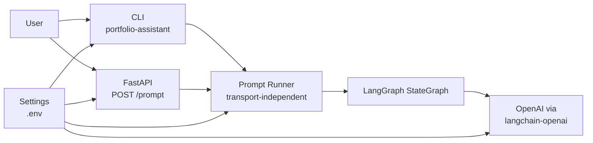
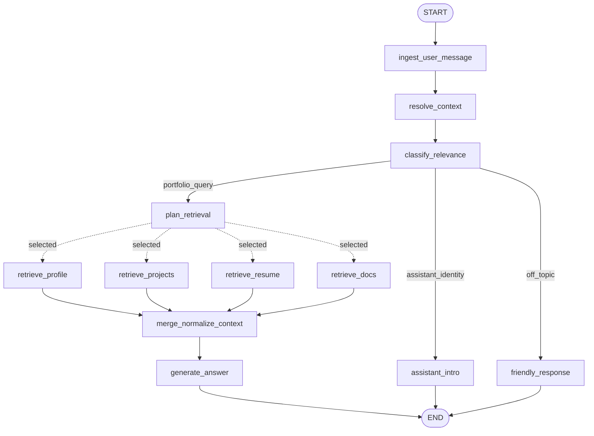

# LangGraph Portfolio Assistant Architecture

This document tracks the architecture of this LangGraph portfolio assistant.

The goal is to provide production-grade boundaries: clear orchestration, explicit state, transport separation, configurable portfolio subject, grounded answers, and testable route decisions.

---

## Current Scope

Implemented phases:

- Phase 0: uv project, FastAPI app, CLI, env template, tests
- Phase 1: minimal LangGraph graph with context resolution, relevance classification, explicit routing, answer generation, assistant intro, and friendly redirect
- Phase 2: retrieval planning with explicit source categories and debug-visible planned sources
- Phase 3A: retrieval nodes, GitHub project retrieval, local resume/docs retrieval, and context merging

Not implemented yet:

- PDF/DOCX resume ingestion
- vector/RAG-backed resume retrieval
- session memory/checkpointing
- streaming
- observability and reliability layers

---

## High-Level System



Key boundary: CLI and FastAPI are transports. They do not own assistant behavior. Both call the same `run_prompt()` service, which invokes the graph and shapes the response.

---

## Current Graph



### Route Categories

| Route | Meaning | Destination |
|---|---|---|
| `portfolio_query` | The user asks about the subject's projects, resume, work history, skills, contact details, or professional fit. | `plan_retrieval` |
| `assistant_identity` | The user asks who the assistant is or what it can do. | `assistant_intro` |
| `off_topic` | The user asks for general knowledge, coding/debugging help, or work on their own project. | `friendly_response` |

This route split exists because a boolean `is_relevant` flag was too coarse. For example, "who are you?" is not a portfolio data question, but it also should not receive the same response as "what is the weather?"

### Retrieval Sources

Phase 2 added source planning. Phase 3A adds source retrieval and context merging.

| Source | Meaning |
|---|---|
| `profile` | Identity, contact details, preferred summary, location, and links |
| `projects` | GitHub or portfolio projects, READMEs, stacks, outcomes, and links |
| `resume` | Resume facts, employment timeline, companies, responsibilities, education, certifications, skills, achievements, and role summaries |
| `docs` | Long-form documents, case studies, blog posts, notes, or custom knowledge |

Decision: keep source planning separate from source execution.

Problem solved: the graph now makes information needs explicit before retrieval exists. Phase 3 can add retrieval nodes without changing classification or answer-generation policy.

Trade-off: Phase 2 adds an extra LLM call for relevant queries before retrieval execution. This is acceptable for inspection and correctness; later we can optimize or combine calls if latency becomes a problem.

### Retrieval Execution

The first retrieval implementation uses:

- GitHub REST API for `projects`; forks are excluded by default for "built projects" accuracy
- local text/markdown files for `resume` and `docs`
- resume-derived profile context for `profile`

The graph dispatches only planned retrieval sources with LangGraph dynamic sends. Independent retrieval nodes can run concurrently, then join at `merge_normalize_context`.

Decision: use conditional fan-out for retrieval execution.

Problem solved: multi-source retrieval avoids unnecessary sequential latency and traces only show selected retrieval nodes.

Trade-off: fan-out introduces more graph-routing complexity and retrieval node ordering in traces should not be treated as semantically meaningful.

Project retrieval strategy:

- Current: fetch recent GitHub repositories for `GITHUB_OWNER`, excluding forks unless `GITHUB_INCLUDE_FORKS=true`.
- Later: enrich project detail with README content, pinned/featured project configuration, scoring, and cache policy.

Problem solved: "what projects has this person built?" should not treat forked repositories as owned work.

Trade-off: excluding forks may hide meaningful fork-based contributions. A future contribution-focused query can use a separate retrieval mode or include forks conditionally.

Resume strategy:

- Current: load a small resume text or Markdown file directly into context. Work-experience questions use the `resume` source because a normal 1-2 page resume already contains the experience section.
- Local testing passes the resume source with `--resume-path`.
- PDF resumes can be converted to Markdown with `scripts/convert_resume_pdf.py`.
- Later: accept PDF/DOCX, normalize into Markdown/JSON during ingestion, then optionally chunk/index for RAG.

Problem solved: a 1-2 page resume usually fits comfortably in context, so RAG is not required for the first useful version.

Trade-off: direct context loading is simpler but less scalable for larger document collections. RAG remains a later upgrade, not a Phase 3 blocker.

---

## State Model

`PortfolioState` is the shared graph state. Nodes return partial updates.

Current keys:

- `user_query`: raw user input after trimming
- `rewritten_query`: context-resolved query
- `messages`: optional prior conversation turns
- `assistant_subject`: configurable portfolio subject, such as `Yubi`
- `portfolio_context`: optional ad-hoc per-request context for manual testing
- `resume_path`: optional per-request resume text/Markdown path
- `is_relevant`: compatibility boolean for answer-generation relevance
- `intent`: short classifier label, such as `projects`, `professional_fit`, `assistant_identity`, or `user_task`
- `route`: graph route category
- `retrieval_sources`: planned source categories for portfolio queries
- `retrieval_reason`: short explanation of why those sources were selected
- `profile_context`, `project_context`, `resume_context`, `docs_context`: raw retrieved source context
- `merged_context`: normalized context passed to answer generation
- `retrieval_errors`: non-fatal retrieval errors collected from source nodes
- `final_answer`: final response text
- `error`: reserved for later reliability handling
- `node_trace`: append-only execution trace used for CLI/API debugging

Decision: keep state explicit and typed with `TypedDict`.

Problem solved: graph behavior is inspectable and each node has a clear input/output contract.

Trade-off: `TypedDict` does not validate data at runtime. We accept this for Phase 1 because LangGraph state updates are simple and tests cover route behavior. If state becomes more complex, we can add Pydantic validation at service boundaries.

---

## Context Resolution

`resolve_context` performs history-aware query contextualization. When prior conversation turns are present, it asks the LLM to rewrite the latest user message into a standalone portfolio question using a bounded recent-history window. If the latest message is already standalone, the prompt instructs the model to return it unchanged.

This follows the same design used by conversational RAG systems: rewrite the user question before classification and retrieval, instead of passing ambiguous follow-ups like "this project" or "the second one" directly into retrieval planning.

Decision: run contextualization whenever conversation history exists, instead of maintaining a hardcoded list of reference trigger phrases.

Problem solved: follow-up handling is not limited to phrases we anticipated in code.

The default history window is 4 turns. This is wide enough for references like "the second project mentioned above" after a short side discussion, while still bounding prompt size.

Trade-off: every follow-up with history incurs one extra LLM call, and a wider history window sends more tokens. If latency or cost becomes an issue, this can be optimized with a cheaper model, caching, or a combined context-resolution/classification step.

---

## Module Boundaries

```text
app/
├── api/                 # HTTP transport only
├── cli.py               # CLI transport only
├── graph/               # LangGraph state, nodes, routing, builder
├── prompts/             # File-backed system prompts
├── services/            # LLM client, prompt runner, prompt rendering
├── config.py            # Environment settings
└── schemas.py           # API/CLI request and response models
```

### Responsibilities

| Module | Owns | Does not own |
|---|---|---|
| `app.api.prompt` | FastAPI route and HTTP exception mapping | graph wiring, prompt text, LLM calls |
| `app.cli` | argument parsing, interactive loop, terminal printing | graph wiring, prompt text, LLM calls |
| `app.services.prompt_runner` | transport-independent request-to-state mapping | HTTP, CLI, LLM prompt wording |
| `app.graph.builder` | graph topology | LLM details, transport details |
| `app.graph.nodes` | node adapters | prompt wording, OpenAI SDK calls |
| `app.services.openai_client` | OpenAI/LangChain integration | graph topology, HTTP/CLI transport |
| `app.services.prompt_templates` | prompt file loading and message construction | OpenAI invocation |
| `app.prompts/*.md` | prompt text | Python behavior |

Decision: isolate orchestration from model calls and transport.

Problem solved: each layer can change independently. For example, Phase 2 can add retrieval nodes without changing CLI argument parsing, and streaming can be added without duplicating graph logic.

Trade-off: more files than a small script. This is intentional because the project is meant to teach production-quality AI system structure.

---

## Architectural Decisions

### 1. Use Python, FastAPI, and LangGraph

Problem: the assistant needs explicit orchestration, HTTP transport, CLI testing, and Python-native AI ecosystem support.

Decision: build with Python, FastAPI, LangGraph, and `langchain-openai`.

Trade-off: this is not framework-minimal. The extra structure is justified because graph orchestration, retrieval, transport, and observability need clear boundaries.

---

### 2. Add a CLI Transport Early

Problem: testing every change through a running API slows local development and creates unnecessary transport noise.

Decision: add `portfolio-assistant` CLI that invokes the same `run_prompt()` service as FastAPI.

Trade-off: one extra transport to maintain. The shared runner keeps the cost low and catches transport-independent bugs quickly.

---

### 3. Keep the Assistant Generic

Problem: the original docs mention Yubi, but a reusable portfolio assistant should work for any subject.

Decision: make `ASSISTANT_SUBJECT`, `GITHUB_OWNER`, and `GITHUB_TOKEN` configuration-driven. Keep local resume files request-driven through `--resume-path` or API request fields.

Trade-off: generic wording can be less personal until profile data is supplied. Later phases should introduce a profile document containing preferred name, pronouns, summary, resume, and tone preferences.

---

### 4. Use Explicit Route Categories Instead of Boolean Relevance Only

Problem: a boolean classifier cannot distinguish "who are you?" from genuine off-topic prompts, and it can let user-task prompts through if they mention technologies in the subject's stack.

Decision: classify into `portfolio_query`, `assistant_identity`, and `off_topic`, while retaining `is_relevant` as a compatibility flag for answer generation.

Problem solved: route behavior is transparent and testable.

Trade-off: route taxonomy needs to be maintained as the assistant grows. This is manageable because route names are centralized in `RouteName`.

---

### 5. Refuse User Coding/Debugging Tasks

Problem: prompts like "fix my TypeScript bug" can be confused with portfolio relevance because TypeScript may be in the subject's stack.

Decision: classify user-task requests as `off_topic` unless the user asks about the portfolio subject's ability or experience.

Problem solved: the assistant stays within the portfolio boundary and avoids becoming a general coding assistant.

Trade-off: users may expect help because the subject has those skills. The redirect explains the boundary and offers portfolio-related alternatives.

---

### 6. Keep Prompt Text in Dedicated Files

Problem: inline prompt strings grow hard to scan, review, and compare across phases.

Decision: store system prompts under `app/prompts/` and keep Python responsible only for loading and rendering messages.

Problem solved: prompt iteration becomes easier and prompt changes are reviewable as content changes.

Trade-off: file I/O is introduced at prompt load time. Prompts are cached with `lru_cache`, so runtime overhead is negligible.

---

### 7. Ground Answers in Retrieved Context

Problem: the assistant should not rely on hardcoded profile text or global fallback context.

Decision: `generate_answer` uses `merged_context` built from planned retrieval sources. Resume/profile-style information comes from the resume source, not a hardcoded profile env var. `--context` remains only for ad-hoc manual testing.

Problem solved: profile, skills, and work-experience answers come from the same user-provided resume source.

Trade-off: CLI/API callers must provide a resume path until a proper upload/ingestion flow exists.

---

### 8. Add Retrieval Planning Before Retrieval Execution

Problem: directly retrieving inside answer generation mixes planning, data access, and synthesis. That makes behavior hard to inspect and harder to evolve into multi-source retrieval.

Decision: add a `plan_retrieval` node that chooses source categories for portfolio queries. The selected sources are stored in graph state and exposed in responses.

Problem solved: information needs become explicit and testable before source-specific retrieval nodes exist.

Trade-off: relevant queries now make an additional LLM call. This may be optimized later with caching, heuristic fallbacks, or combined classification/planning if needed.

---

### 9. Use History-Aware Context Resolution

Problem: follow-up questions can reference prior answers in many ways, such as "this project", "it", "the second one", or implied subjects. A hardcoded trigger list is brittle and grows without a clear boundary.

Decision: if conversation history exists, `resolve_context` asks the LLM to rewrite the latest user message into a standalone question, returning it unchanged when no rewrite is needed.

Problem solved: contextual references are resolved semantically instead of by phrase matching.

Trade-off: follow-up turns make an extra LLM call. This is acceptable for correctness during the current phase; later optimization can use a cheaper model, cache, or combined classification/contextualization.

---

### 10. Keep Retrieval Failures Non-Fatal

Problem: one missing source, such as a missing resume file, should not fail the entire assistant response if other context is available.

Decision: retrieval nodes return content or an error string. Errors are stored in `retrieval_errors`; context merging continues with successful sources.

Problem solved: partial data can still produce a grounded answer.

Trade-off: answer quality depends on what was retrieved. The CLI/API debug fields expose skipped or failed sources so failures are inspectable.

---

### 11. Use Tests for Graph Route Behavior

Problem: LLM behavior can drift, but graph topology and route handling should remain deterministic.

Decision: test graph routing with a fake assistant service and reserve real OpenAI calls for smoke checks.

Problem solved: route regressions are caught quickly without requiring API keys in CI.

Trade-off: fake-service tests do not prove prompt quality. We supplement with manual CLI checks during development.

---

### 12. Add Graph Execution Logging

Problem: `node_trace` shows the final path, but it does not show duration, intermediate updates, or where a run is currently spending time.

Decision: use Python's standard `logging` module with a central formatter, CLI log-level controls, node start/done/error logs, and route decision logs.

Problem solved: local runs expose graph execution in real time without adding a new observability vendor.

Trade-off: console logs are less queryable than structured JSON traces. Later observability work can add JSON logging and LangSmith while keeping these local logs useful.

---

## Current Runtime Examples

Assistant identity:

```powershell
uv run portfolio-assistant "who are you" --show-trace
```

Expected trace:

```text
ingest_user_message -> resolve_context -> classify_relevance -> assistant_intro
```

User-task redirect:

```powershell
uv run portfolio-assistant "can you help me fix bug in one of my typescript project" --show-trace
```

Expected trace:

```text
ingest_user_message -> resolve_context -> classify_relevance -> friendly_response
```

Portfolio-fit answer:

```powershell
uv run portfolio-assistant "can Yubi help with TypeScript backend systems?" --subject "Yubi" --resume-path "data/processed/resume.md"
```

Expected trace:

```text
ingest_user_message -> resolve_context -> classify_relevance -> plan_retrieval -> retrieve_projects -> retrieve_resume -> merge_normalize_context -> generate_answer
```

---

## Future Architecture Updates

This document should be updated whenever a phase changes system behavior. Expected next updates:

- Phase 4: context merge, scoring, dedupe, and context budget policy
- Phase 6: memory and checkpointing strategy
- Phase 8: streaming transport and event contract
- Phase 9: logging, tracing, and LangSmith decisions
- Phase 10: retries, fallbacks, timeout policy, and partial answers

---

## Planned Phase 6 Session Contract

The Phase 6 API memory contract will use an application-level `session_id`.

Planned request shape:

- `POST /prompt`
- body includes optional `session_id`

Planned behavior:

- if `session_id` is omitted, the API creates a new session and returns its id
- if `session_id` is present and active, the API reuses stored history for that session
- if `session_id` is present but missing or expired, the API should return a client-visible session error rather than silently creating a different conversation

Planned response shape:

- `session_id` is always returned so clients can continue the same conversation explicitly

The first implementation will use a simple app-level session store. LangGraph checkpointers will be evaluated after the request/response contract and lifecycle behavior are stable.
