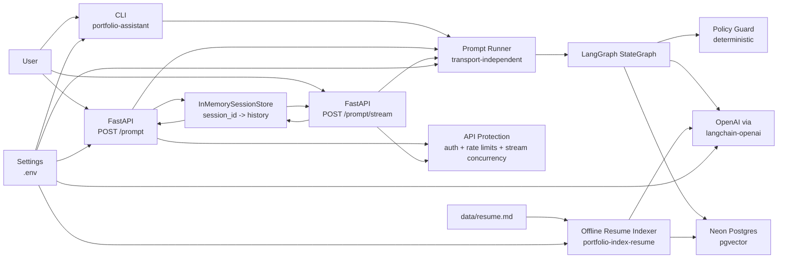
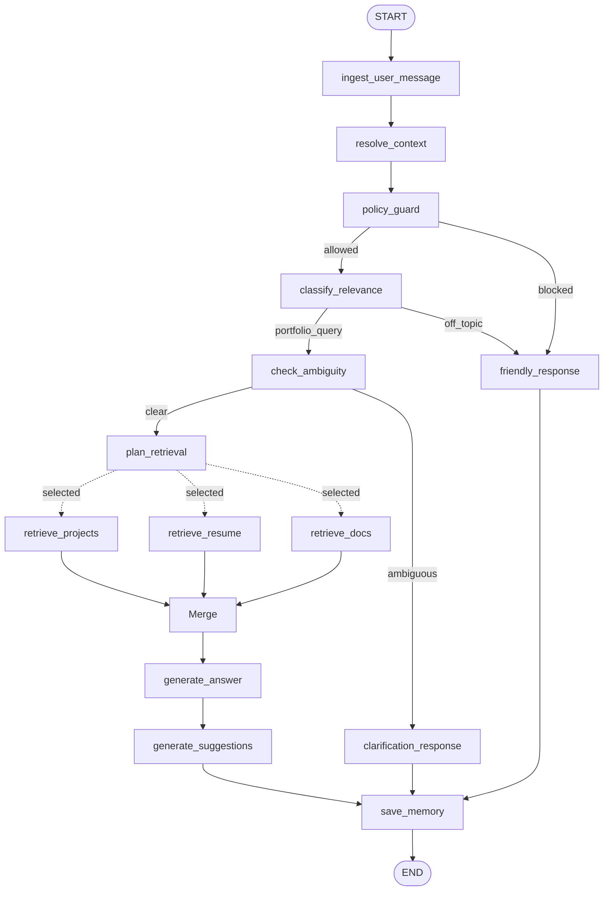
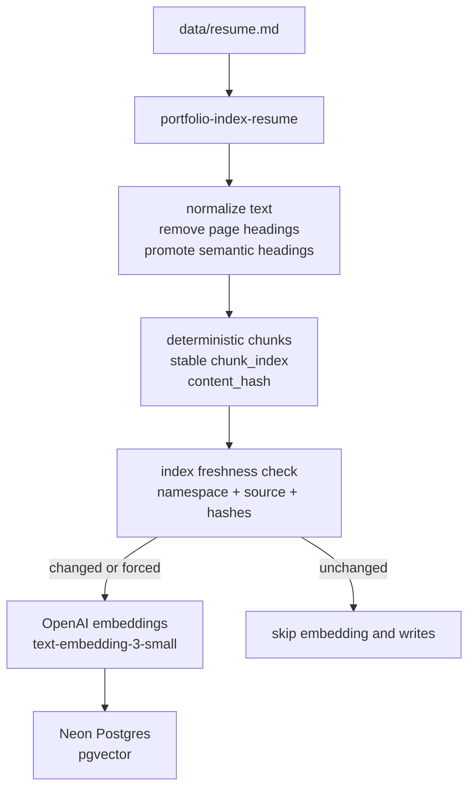
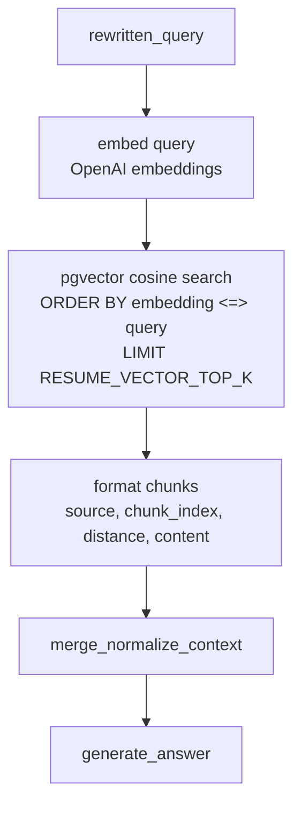
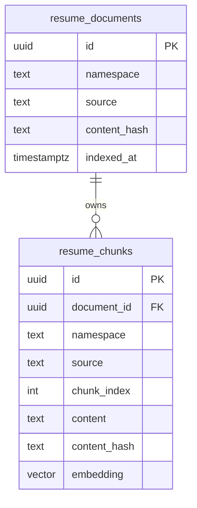

# LangGraph Portfolio Assistant Architecture

This document tracks the architecture of this LangGraph portfolio assistant.

The goal is to provide production-grade boundaries: clear orchestration, explicit state, transport separation, configurable portfolio subject, grounded answers, and testable route decisions.

---

## Current Scope

Implemented phases:

- Phase 0: uv project, FastAPI app, CLI, env template, tests
- Phase 1: minimal LangGraph graph with context resolution, relevance classification, explicit routing, answer generation, and friendly redirect
- Phase 2: retrieval planning with explicit source categories and debug-visible planned sources
- Phase 3A: retrieval nodes, GitHub project retrieval, local resume/docs retrieval, and context merging
- Phase 6A/B: API session contract, app-level session store, explicit `save_memory` graph step, and checkpointer evaluation
- Phase 8A: SSE streaming route reusing the existing prompt runner and graph-level answer-token streaming
- Phase 12A/B: offline resume embedding ingestion, Neon pgvector storage, semantic resume chunking, and vector-backed resume retrieval
- Clarification guard rail: deterministic ambiguity detection for risky follow-up references
- Policy guard: deterministic blocking for prompt injection, prompt extraction, unsafe fabrication, secrets, and harmful-content requests
- Public API protection: browser auth, in-process request rate limiting, and active stream concurrency limiting

Not implemented yet:

- PDF/DOCX resume ingestion
- external observability layers
- advanced reliability layers

---

## High-Level System



Key boundary: CLI and FastAPI are transports. They do not own assistant behavior. Both call the same `run_prompt()` service, which invokes the graph and shapes the response.

The streaming route keeps this boundary intact: SSE framing stays in `app.api.prompt`, while orchestration and answer generation remain in the shared prompt runner and graph-backed services.

---

## Agent Harness Design

This project is not relying on LangGraph as a magic agent layer. LangGraph provides the orchestration runtime, but the assistant behavior comes from the harness built around it.

The harness is the set of contracts, boundaries, deterministic checks, retrieval services, prompt contracts, and response-shaping rules that make the assistant reliable.

### Harness Responsibilities

| Harness Layer | Implementation | Responsibility |
|---|---|---|
| Transport boundary | CLI, FastAPI, `app.services.prompt_runner` | Keep CLI, non-streaming API, and streaming API on the same graph-backed behavior |
| State contract | `PortfolioState` | Carry query, rewritten query, policy status, route, intent, retrieval plan, retrieved context, answer, memory, and trace |
| Orchestration runtime | LangGraph `StateGraph` | Execute nodes, conditional routes, retrieval fan-out, merge, and memory save in an inspectable order |
| Prompt contracts | `app/prompts/*.md` | Keep each LLM call focused on one decision instead of asking one giant prompt to do everything |
| Structured LLM outputs | `RelevanceDecision`, `RetrievalPlan` | Convert LLM decisions into typed route/source data that the graph can safely branch on |
| Deterministic guard rails | `policy_guard`, `check_ambiguity`, context bounds | Keep cheap, testable logic outside the LLM when the behavior does not require generation |
| Retrieval layer | `ConfiguredPortfolioRetrievalService`, GitHub, README enrichment, featured metadata, resume pgvector, docs | Provide grounded evidence instead of asking the model to rely on memory or inference |
| Memory/session layer | API session store, bounded `messages`, `save_memory` | Support follow-up questions without unbounded context growth |
| Observability | node traces, request/session logging, streaming progress events | Make each decision and route visible during CLI/API debugging |

### Why This Matters

A single-prompt assistant would have to classify relevance, resolve follow-ups, decide sources, retrieve facts, avoid jailbreaks, merge evidence, answer, and remember the turn all inside one opaque model call.

This harness splits those responsibilities into smaller units:

- `resolve_context` turns follow-up questions into standalone questions when history is available.
- `policy_guard` blocks obvious unsafe prompt patterns before classification or retrieval.
- `classify_relevance` decides whether the request belongs to the portfolio domain.
- `check_ambiguity` asks for clarification when a follow-up reference cannot be safely resolved.
- `plan_retrieval` selects the smallest useful source set.
- retrieval nodes fetch evidence only from planned sources.
- `merge_normalize_context` bounds and labels evidence.
- `generate_answer` answers only from the merged context.
- `save_memory` stores the completed turn within a bounded session window.

Decision: keep the assistant as a simple, explicit harness rather than a general autonomous agent.

Problem solved: portfolio Q&A needs reliable grounding, follow-up handling, public-safety boundaries, and traceability more than it needs open-ended tool use or recursive planning.

Trade-off: this design uses multiple small steps, so relevant requests can require more than one LLM call. The benefit is that each decision is inspectable, testable, and replaceable. If latency becomes a real issue, context resolution, classification, and retrieval planning can be optimized or selectively combined without changing the whole architecture.

### LangGraph's Role

LangGraph is responsible for:

- explicit node execution
- conditional routing
- state accumulation
- parallel retrieval fan-out through dynamic sends
- graph-level streaming metadata
- traceable orchestration

LangGraph is not responsible for:

- deciding the product boundary
- enforcing the grounding policy by itself
- choosing retrieval quality rules
- designing prompt contracts
- implementing session semantics
- preventing unsafe prompts without our guard logic

Those behaviors come from the harness. LangGraph makes them easier to compose and observe.

---

## Public API Protection

The public API now has three lightweight abuse-protection layers before expensive assistant work runs:

- optional browser auth for expensive prompt endpoints
- request rate limiting for `/prompt`
- request rate limiting plus active stream concurrency limiting for `/prompt/stream`
- production-mode hiding for development-only API docs/routes

Rate limiting uses the maintained `limits` library with `MemoryStorage` and a fixed-window strategy. The project does not hand-roll rate-limit counters or time-window math.

Configuration:

| Setting | Default | Meaning |
|---|---:|---|
| `APP_ENV` | `development` | Set to `production` to hide `/docs`, `/redoc`, and `/openapi.json` |
| `RATE_LIMIT_ENABLED` | `true` | Enables/disables request rate limits |
| `PROMPT_RATE_LIMIT` | `30/minute` | Max `/prompt` requests per client |
| `PROMPT_STREAM_RATE_LIMIT` | `10/minute` | Max `/prompt/stream` requests per client |
| `AUTH_SESSION_RATE_LIMIT` | `3/minute` | Max `/auth/session` requests per client |
| `AUTH_TOKEN_RATE_LIMIT` | `10/minute` | Max `/auth/token` requests per client |
| `MAX_ACTIVE_STREAMS_PER_CLIENT` | `2` | Max concurrent active SSE streams per client |

HTTP errors use a structured response contract:

```json
{
  "error": {
    "status": 429,
    "code": "RATE_LIMIT_EXCEEDED",
    "message": "Rate limit exceeded."
  }
}
```

API-facing errors are represented internally with a common `AppError` base class. Each concrete error owns its HTTP status, stable machine-readable code, and safe client message. Route handlers convert `AppError` instances into the response contract above, instead of duplicating error-shape logic per endpoint.

FastAPI request validation errors and framework HTTP exceptions are also normalized globally. Validation responses include only safe field-level details (`field`, `message`) and intentionally omit raw input values.

Current HTTP error codes include:

| Code | Meaning |
|---|---|
| `CONFIGURATION_ERROR` | Application configuration is invalid |
| `VALIDATION_ERROR` | Request body, path, query, or header validation failed |
| `BAD_REQUEST` | Request validation or prompt input failed |
| `SESSION_NOT_FOUND` | Supplied `session_id` does not exist or expired |
| `UPSTREAM_SERVICE_ERROR` | Upstream AI service failed |
| `PROMPT_PROCESSING_FAILED` | Unexpected prompt processing failure |
| `RATE_LIMIT_EXCEEDED` | Request rate limit exceeded |
| `STREAM_CONCURRENCY_LIMIT_EXCEEDED` | Too many active SSE streams for one client |
| `AUTH_REQUIRED` | Protected endpoint needs a valid access token or refresh cookie |
| `INVALID_TOKEN` | Token is invalid, expired, malformed, or wrong type |
| `AUTH_CONFIGURATION_ERROR` | Auth is enabled or called but auth configuration is incomplete |
| `ORIGIN_NOT_ALLOWED` | Browser origin is not allowlisted for auth endpoints |
| `TURNSTILE_VERIFICATION_FAILED` | Cloudflare Turnstile verification failed |

### Browser Auth Flow

The browser auth contract is intentionally frontend-agnostic so it can support a public portfolio UI now and a user-centric SaaS product later.

```mermaid
sequenceDiagram
    participant B as Browser
    participant CF as Cloudflare Turnstile
    participant API as LangGraph API

    B->>API: POST /auth/token<br/>credentials: include
    API-->>B: 401 AUTH_REQUIRED<br/>if refresh cookie missing/expired
    B->>CF: execute Turnstile
    CF-->>B: turnstile_token
    B->>API: POST /auth/session<br/>{turnstile_token}<br/>credentials: include
    API->>CF: verify token server-side
    CF-->>API: success
    API-->>B: 200 + Set-Cookie refresh_token<br/>HttpOnly; Secure; SameSite
    B->>API: POST /auth/token<br/>credentials: include
    API-->>B: {access_token, expires_in}
    B->>API: POST /prompt or /prompt/stream<br/>Authorization: Bearer access_token
```

The refresh token is a longer-lived app-owned JWT stored in an HttpOnly cookie. The access token is a short-lived app-owned JWT returned to the frontend and kept in memory. Both tokens use `HS256` through the maintained `PyJWT` library and include token type, session id, issuer, audience, issued-at, expiry, and token id claims.

Decision: use app-owned JWT refresh/access tokens with Turnstile as the current human-verification bootstrap.

Problem solved: rate limiting alone does not stop scripted browser abuse or accidental public cost spikes. Turnstile protects token issuance, and short-lived access tokens protect expensive assistant endpoints.

Trade-off: this is not user identity. It proves a browser session passed Turnstile. A future identity provider such as GitHub OAuth can replace or augment the bootstrap step while preserving the same backend-owned refresh/access token model.

Decision: use in-memory rate limiting for the first public-hardening cut.

Problem solved: the public API can trigger OpenAI, GitHub, and vector-store work. Rate limits and stream caps reduce accidental cost spikes and basic abuse before auth is implemented.

Trade-off: in-memory limits are process-local. They are fine for a single-instance deployment, but they do not coordinate across multiple replicas. If this service runs horizontally, the rate-limit storage should move to shared infrastructure such as Redis.

---

## Current Graph



### Route Categories

| Route | Meaning | Destination |
|---|---|---|
| `portfolio_query` | The user asks about the subject's projects, resume, work history, skills, contact details, self-introduction, or professional fit. | `plan_retrieval` |
| `off_topic` | The user asks for general knowledge, coding/debugging help, or work on their own project. | `friendly_response` |

This route split exists because a boolean `is_relevant` flag was too coarse. Portfolio identity questions such as "who are you?" now flow through the normal portfolio retrieval path, while only genuinely unrelated prompts go to `off_topic`.

### Policy Guard

The graph runs `policy_guard` after context resolution and before relevance classification.

It is intentionally deterministic rather than another LLM call. The guard blocks obvious unsafe prompt patterns before they can influence source planning or retrieval:

- instruction override attempts such as "ignore previous instructions"
- hidden prompt or developer-message extraction
- fabricated portfolio claims such as fake projects, fake experience, or fake resume facts
- secret or credential requests such as API keys, access tokens, private keys, or passwords
- harmful-content requests such as malware, phishing, ransomware, keyloggers, and credential theft

Decision: keep this as a narrow first-pass safety boundary.

Problem solved: portfolio-framed jailbreak prompts can otherwise pass relevance classification because they mention the portfolio subject. The policy guard catches the unsafe intent before the assistant spends tokens on classification, retrieval planning, or retrieval.

Trade-off: deterministic patterns can miss novel jailbreak phrasing and can occasionally over-block. This is acceptable for the first public-hardening step because it is cheap, explainable, testable, and complements the existing grounded-answer rule. A later phase can add a small LLM-backed safety classifier or evaluation corpus if needed.

### Retrieval Sources

Phase 2 added source planning. Phase 3A adds source retrieval and context merging.

| Source | Meaning |
|---|---|
| `projects` | GitHub or portfolio projects, READMEs, stacks, outcomes, and links |
| `resume` | Resume facts, employment timeline, companies, responsibilities, education, certifications, skills, achievements, and role summaries |
| `docs` | Long-form documents, case studies, blog posts, notes, or custom knowledge |

Decision: keep source planning separate from source execution.

Problem solved: the graph now makes information needs explicit before retrieval exists. Phase 3 can add retrieval nodes without changing classification or answer-generation policy.

Trade-off: Phase 2 adds an extra LLM call for relevant queries before retrieval execution. This is acceptable for inspection and correctness; later we can optimize or combine calls if latency becomes a problem.

### Retrieval Execution

The first retrieval implementation uses:

- GitHub REST API for `projects`; forks are excluded by default for "built projects" accuracy
- best-effort README enrichment for selected repositories, bounded by `GITHUB_README_MAX_CHARS`
- focused named-repository retrieval for project deep dives, bounded by `GITHUB_TARGET_README_MAX_CHARS`
- vector-backed resume retrieval from Neon pgvector when `NEON_DATABASE_URL_STRING` is configured
- local text/markdown files for `docs`
- local file override for `resume` when an explicit `resume_path` is supplied
- curated featured project metadata from `FEATURED_PROJECTS_PATH` for subjective project preference questions

The graph dispatches only planned retrieval sources with LangGraph dynamic sends. Independent retrieval nodes can run concurrently, then join at `merge_normalize_context`.

Decision: use conditional fan-out for retrieval execution.

Problem solved: multi-source retrieval avoids unnecessary sequential latency and traces only show selected retrieval nodes.

Trade-off: fan-out introduces more graph-routing complexity and retrieval node ordering in traces should not be treated as semantically meaningful.

Project retrieval strategy:

- Current: fetch GitHub repository metadata for `GITHUB_OWNER`, excluding forks unless `GITHUB_INCLUDE_FORKS=true`.
- Broad project questions format the most recent `GITHUB_PROJECTS_LIMIT` repositories and fetch bounded README excerpts when available.
- Named project questions, including context-resolved follow-ups, focus retrieval on the matching repository and fetch a larger README excerpt for deeper answers.
- Subjective project preference questions, such as "most proud of", "favorite", "flagship", or "most impressive", prioritize curated featured project metadata when available.
- Later: optionally pull GitHub pinned repositories through GraphQL, add scoring, and add a cache policy.

Problem solved: "what projects has this person built?" should not treat forked repositories as owned work.
Project-specific questions should not dump unrelated repositories into context when the user clearly asks about one repo.

Trade-off: excluding forks may hide meaningful fork-based contributions. README fetches are best-effort, so repositories without a README still work but provide less detail. Named-repository matching depends on the repo name appearing in the rewritten query; future scoring or embeddings can improve fuzzy project matching.

Resume strategy:

- Current production path: resume-related queries embed the rewritten query, search top-k chunks in Neon pgvector, and pass retrieved chunks into answer generation.
- Ingestion path: `portfolio-index-resume` reads `data/resume.md`, normalizes it into semantic Markdown, chunks it deterministically, embeds chunks with `OPENAI_EMBEDDING_MODEL`, and upserts them into Neon.
- CLI/API still support explicit `resume_path` as a local-file override for development and debugging.
- PDF resumes can be loaded directly only through the local-file path. Production RAG ingestion currently expects Markdown.
- Later: normalize PDF/DOCX into Markdown/JSON before indexing, then apply the same vector ingestion path.

Problem solved: resume retrieval now follows production-like RAG behavior instead of injecting the whole resume into the prompt, while keeping local override ergonomics for development.

Trade-off: RAG adds OpenAI embedding latency and a database dependency per resume query. This is acceptable because resume retrieval now scales beyond one small file and mirrors the architecture needed for larger knowledge sources.

---

## Resume RAG And Embedding Architecture

Resume RAG has two separate flows: offline ingestion and runtime retrieval. Keeping these separate is intentional.

### Offline Ingestion Flow



The indexer owns heavy work. API startup does not generate embeddings and request handling never performs indexing.

### Runtime Retrieval Flow



Runtime retrieval is used only when the planner selects the `resume` source and no explicit `resume_path` override is supplied.

### Suggested Follow-Ups

`generate_suggestions` runs after `generate_answer` for normal portfolio answers. It produces structured `suggested_prompts` instead of appending follow-up text to the answer.

This keeps the answer natural while giving API and frontend clients optional next-step prompts to render as chips or terminal suggestions.

The node is intentionally conditional inside its implementation:

- generate suggestions for project, profile, skills, experience, resume, and professional-fit style answers
- skip suggestions for education, contact, policy/off-topic, clarification, or empty-answer cases
- cap suggestions to 3 short grounded prompts

Problem solved: inline prompt-only suggestions were not reliable enough. A separate structured node gives the frontend a clean field and keeps suggestion generation isolated from answer wording.

Trade-off: eligible answers add one extra LLM call. The deterministic skip rules avoid paying that cost for simple factual answers.

### Storage Model



`resume_documents` tracks the indexed source and full-document hash. `resume_chunks` stores searchable text chunks and embeddings. Unique keys on `(namespace, source)` and `(namespace, source, chunk_index)` make ingestion deterministic and repeatable.

### Chunking Strategy

The source resume is extracted Markdown, but its section labels are plain uppercase text rather than real Markdown headings. The indexer therefore performs deterministic semantic normalization before chunking:

- promote `PROFILE`, `CORE SKILLS`, `SELECTED AI PROJECTS`, `EXPERIENCE`, `EDUCATION`, and `CERTIFICATIONS` to `##` headings
- promote individual selected projects and experience roles to `###` headings
- keep education and certifications as compact sections so closely related facts stay together
- split oversized sections by paragraph, then by words, using `RESUME_CHUNK_MAX_CHARS`

This gives the vector store meaningful retrieval units such as:

- `## Profile`
- `## Core Skills`
- `### MCP Terminal Portfolio - yubi.sh`
- `### Senior Backend Developer - FifthDomain`
- `## Education`
- `## Certifications`

Decision: semantic section chunking before embeddings instead of overlapping fixed-size chunks.

Problem solved: resume queries retrieve meaningful professional sections rather than arbitrary page fragments.

Trade-off: this is tailored to resume-like documents and known labels. It is deterministic and easy to inspect, but not a general document parser. For broader docs/case studies, a separate chunking policy may be needed.

### Runtime Logs

Resume vector retrieval emits explicit logs:

```text
resume vector retrieval | namespace=default | top_k=5
resume vector retrieval complete | namespace=default | chunks=5
```

These logs confirm whether a resume query used pgvector instead of local file injection.

---

## State Model

`PortfolioState` is the shared graph state. Nodes return partial updates.

Current keys:

- `user_query`: raw user input after trimming
- `rewritten_query`: context-resolved query
- `messages`: optional prior conversation turns
- `assistant_subject`: configurable portfolio subject, such as `Yubi`
- `portfolio_context`: optional ad-hoc per-request context for manual testing
- `resume_path`: optional per-request resume text/Markdown path
- `is_relevant`: compatibility boolean for answer-generation relevance
- `intent`: short classifier label, such as `projects`, `professional_fit`, `profile`, or `user_task`
- `route`: graph route category
- `retrieval_sources`: planned source categories for portfolio queries
- `retrieval_reason`: short explanation of why those sources were selected
- `project_context`, `resume_context`, `docs_context`: raw retrieved source context
- `merged_context`: normalized context passed to answer generation
- `retrieval_errors`: non-fatal retrieval errors collected from source nodes
- `final_answer`: final response text
- `suggested_prompts`: optional grounded follow-up prompts generated after the answer
- `error`: reserved for later reliability handling
- `node_trace`: append-only execution trace used for CLI/API debugging

Decision: keep state explicit and typed with `TypedDict`.

Problem solved: graph behavior is inspectable and each node has a clear input/output contract.

Trade-off: `TypedDict` does not validate data at runtime. We accept this for Phase 1 because LangGraph state updates are simple and tests cover route behavior. If state becomes more complex, we can add Pydantic validation at service boundaries.

---

## Context Resolution

`resolve_context` performs history-aware query contextualization. When prior conversation turns are present, it asks the LLM to rewrite the latest user message into a standalone portfolio question using a bounded recent-history window. If the latest message is already standalone, the prompt instructs the model to return it unchanged.

This follows the same design used by conversational RAG systems: rewrite the user question before classification and retrieval, instead of passing ambiguous follow-ups like "this project" or "the second one" directly into retrieval planning.

Decision: run contextualization whenever conversation history exists, instead of maintaining a hardcoded list of reference trigger phrases.

Problem solved: follow-up handling is not limited to phrases we anticipated in code.

The default history window is 4 turns. This is wide enough for references like "the second project mentioned above" after a short side discussion, while still bounding prompt size.

Trade-off: every follow-up with history incurs one extra LLM call, and a wider history window sends more tokens. If latency or cost becomes an issue, this can be optimized with a cheaper model, caching, or a combined context-resolution/classification step.

---

## Clarification Guard Rail

`check_ambiguity` sits between relevance classification and retrieval planning.

Current behavior:

- if the rewritten query is clear enough, the graph continues to `plan_retrieval`
- if the rewritten query still contains a risky ambiguous reference and recent assistant history contains multiple plausible list candidates, the graph asks a short clarification question instead of guessing
- if the rewritten query contains enough descriptive evidence to uniquely match one candidate, clarification is skipped

Decision: keep ambiguity handling deterministic and narrow instead of adding another LLM call.

Problem solved: the assistant avoids wrong confident guesses in follow-up edge cases while still trusting successful context resolution.

Trade-off: this guard rail is intentionally conservative in scope and should trigger rarely. It is not meant to replace context resolution; it exists as a safety check when context resolution cannot safely recover one target.

---

## Session Memory

Phase 6A introduces an application-level session store for the API and an explicit `save_memory` node in the graph.

Current behavior:

- CLI keeps one in-process conversation history while the process is running
- API accepts an optional `session_id`
- if `session_id` is omitted, `/prompt` creates a new session
- if `session_id` is present and active, `/prompt` loads stored history and passes it into the graph
- the graph appends the current turn in `save_memory`
- the API persists the graph-returned history back into the session store
- if `session_id` is missing or expired, `/prompt` returns a `404` session error

Decision: keep the first persisted-memory implementation outside LangGraph checkpointers and use a simple app-level store with TTL and bounded turn history.

Problem solved: follow-up questions can now work across API requests, not just inside one running CLI process.

Trade-off: this store is process-local and non-durable. Sessions are lost on restart and do not scale across multiple app instances. This is acceptable for the current learning phase; LangGraph checkpointers are deferred until the project needs durable sessions, multi-instance memory, interrupt/resume workflows, or broader persisted graph state.

---

## Module Boundaries

```text
app/
├── api/                 # HTTP transport only
├── cli.py               # CLI transport only
├── graph/               # LangGraph state, nodes, routing, builder
├── prompts/             # File-backed system prompts
├── services/            # LLM client, prompt runner, prompt rendering
├── config.py            # Environment settings
└── schemas.py           # API/CLI request and response models
```

### Responsibilities

| Module | Owns | Does not own |
|---|---|---|
| `app.api.prompt` | FastAPI route and HTTP exception mapping | graph wiring, prompt text, LLM calls |
| `app.cli` | argument parsing, interactive loop, terminal printing | graph wiring, prompt text, LLM calls |
| `app.services.prompt_runner` | transport-independent request-to-state mapping | HTTP, CLI, LLM prompt wording |
| `app.graph.builder` | graph topology | LLM details, transport details |
| `app.graph.nodes` | node adapters | prompt wording, OpenAI SDK calls |
| `app.services.openai_client` | OpenAI/LangChain integration | graph topology, HTTP/CLI transport |
| `app.services.prompt_templates` | prompt file loading and message construction | OpenAI invocation |
| `app.prompts/*.md` | prompt text | Python behavior |

Decision: isolate orchestration from model calls and transport.

Problem solved: each layer can change independently. For example, Phase 2 can add retrieval nodes without changing CLI argument parsing, and streaming can be added without duplicating graph logic.

Trade-off: more files than a small script. This is intentional because the project is meant to teach production-quality AI system structure.

---

## Architectural Decisions

### 1. Use Python, FastAPI, and LangGraph

Problem: the assistant needs explicit orchestration, HTTP transport, CLI testing, and Python-native AI ecosystem support.

Decision: build with Python, FastAPI, LangGraph, and `langchain-openai`.

Trade-off: this is not framework-minimal. The extra structure is justified because graph orchestration, retrieval, transport, and observability need clear boundaries.

---

### 2. Add a CLI Transport Early

Problem: testing every change through a running API slows local development and creates unnecessary transport noise.

Decision: add `portfolio-assistant` CLI that invokes the same `run_prompt()` service as FastAPI.

Trade-off: one extra transport to maintain. The shared runner keeps the cost low and catches transport-independent bugs quickly.

---

### 3. Keep the Assistant Generic

Problem: the original docs mention Yubi, but a reusable portfolio assistant should work for any subject.

Decision: make `ASSISTANT_SUBJECT`, `GITHUB_OWNER`, and `GITHUB_TOKEN` configuration-driven. Load the resume from a standard server-side source by default, while keeping `--resume-path` as a CLI-only local testing override.

Trade-off: generic wording can be less personal until richer portfolio documents are supplied. Later phases can add optional profile metadata, such as preferred name, pronouns, summary, or tone preferences, as a distinct source only if it proves useful.

---

### 4. Use Explicit Route Categories Instead of Boolean Relevance Only

Problem: a boolean classifier cannot distinguish portfolio questions from genuine off-topic prompts, and it can let user-task prompts through if they mention technologies in the subject's stack.

Decision: classify into `portfolio_query` and `off_topic`, while retaining `is_relevant` as a compatibility flag for answer generation.

Problem solved: route behavior is transparent and testable.

Trade-off: route taxonomy needs to be maintained as the assistant grows. This is manageable because route names are centralized in `RouteName`.

---

### 5. Refuse User Coding/Debugging Tasks

Problem: prompts like "fix my TypeScript bug" can be confused with portfolio relevance because TypeScript may be in the subject's stack.

Decision: classify user-task requests as `off_topic` unless the user asks about the portfolio subject's ability or experience.

Problem solved: the assistant stays within the portfolio boundary and avoids becoming a general coding assistant.

Trade-off: users may expect help because the subject has those skills. The redirect explains the boundary and offers portfolio-related alternatives.

---

### 6. Keep Prompt Text in Dedicated Files

Problem: inline prompt strings grow hard to scan, review, and compare across phases.

Decision: store system prompts under `app/prompts/` and keep Python responsible only for loading and rendering messages.

Problem solved: prompt iteration becomes easier and prompt changes are reviewable as content changes.

Trade-off: file I/O is introduced at prompt load time. Prompts are cached with `lru_cache`, so runtime overhead is negligible.

---

### 7. Ground Answers in Retrieved Context

Problem: the assistant should not rely on hardcoded identity text or global fallback context.

Decision: `generate_answer` uses `merged_context` built from planned retrieval sources. Identity, work-history, and skills information comes from the resume source instead of a special hardcoded intro or separate profile retriever. `--context` remains only for ad-hoc manual testing.

Problem solved: identity, skills, and work-experience answers come from the same user-provided resume source.

Answer generation also has an explicit conversation-style contract. Broad profile questions should read like a sharp human intro instead of a resume dump, subjective project questions should use natural preference wording when curated preference metadata exists, and detailed follow-up questions should expand with concrete evidence.

Trade-off: the assistant currently assumes the resume is the primary identity source. If future requirements need separate profile metadata, that should be introduced as a genuinely distinct source instead of a thin wrapper around the resume. Prompt-level style rules improve answer quality without adding another graph node, but they are still model-following instructions rather than deterministic formatting.

---

### 8. Add Retrieval Planning Before Retrieval Execution

Problem: directly retrieving inside answer generation mixes planning, data access, and synthesis. That makes behavior hard to inspect and harder to evolve into multi-source retrieval.

Decision: add a `plan_retrieval` node that chooses source categories for portfolio queries. The selected sources are stored in graph state and exposed in responses.

Problem solved: information needs become explicit and testable before source-specific retrieval nodes exist.

Trade-off: relevant queries now make an additional LLM call. This may be optimized later with caching, heuristic fallbacks, or combined classification/planning if needed.

---

### 9. Use History-Aware Context Resolution

Problem: follow-up questions can reference prior answers in many ways, such as "this project", "it", "the second one", or implied subjects. A hardcoded trigger list is brittle and grows without a clear boundary.

Decision: if conversation history exists, `resolve_context` asks the LLM to rewrite the latest user message into a standalone question, returning it unchanged when no rewrite is needed.

Problem solved: contextual references are resolved semantically instead of by phrase matching.

Trade-off: follow-up turns make an extra LLM call. This is acceptable for correctness during the current phase; later optimization can use a cheaper model, cache, or combined classification/contextualization.

---

### 10. Keep Retrieval Failures Non-Fatal

Problem: one missing source, such as a missing resume file, should not fail the entire assistant response if other context is available.

Decision: retrieval nodes return content or an error string. Errors are stored in `retrieval_errors`; context merging continues with successful sources.

Problem solved: partial data can still produce a grounded answer.

Trade-off: answer quality depends on what was retrieved. The CLI/API debug fields expose skipped or failed sources so failures are inspectable.

---

### 11. Use Tests for Graph Route Behavior

Problem: LLM behavior can drift, but graph topology and route handling should remain deterministic.

Decision: test graph routing with a fake assistant service and reserve real OpenAI calls for smoke checks.

Problem solved: route regressions are caught quickly without requiring API keys in CI.

Trade-off: fake-service tests do not prove prompt quality. We supplement with manual CLI checks during development.

---

### 12. Add Graph Execution Logging

Problem: `node_trace` shows the final path, but it does not show duration, intermediate updates, or where a run is currently spending time.

Decision: use Python's standard `logging` module with a central formatter, CLI log-level controls, node start/done/error logs, route decision logs, and API-generated `request_id` / `session_id` correlation carried into graph state.

Problem solved: local runs expose graph execution in real time without adding a new observability vendor.

Trade-off: plain text logs are easier to read locally, while structured JSON logs are better for aggregation. The current implementation supports both, with text as the default and JSON as an opt-in mode.

---

### 13. Add App-Level Session Memory Before Checkpointers

Problem: follow-up handling should work across API requests, but introducing LangGraph checkpointers immediately would add another abstraction before the API memory contract and lifecycle behavior are stable.

Decision: first implement a simple app-level `session_id` contract with an in-memory session store, TTL eviction, bounded history, and an explicit `save_memory` graph step.

Problem solved: API clients can continue the same conversation across requests while memory ownership becomes clearer inside the graph.

Trade-off: the first persisted-memory implementation is local to one process and not durable. This is intentionally temporary and gives us a stable baseline to compare against LangGraph-native memory later.

---

### 14. Defer LangGraph Checkpointers For This Repo

Problem: LangGraph checkpointers are useful for thread persistence, durable execution, interrupt/resume, and richer graph-state recovery, but they add another persistence abstraction and more infrastructure.

Decision: do not adopt checkpointers in this portfolio assistant yet. Keep the current bounded app-level session store as the memory mechanism for this repo.

Problem solved: the project keeps a simpler memory model that is easier to inspect, explain, and test while still supporting contextual follow-up questions across API requests.

Trade-off: sessions are not durable across restarts and do not scale across multiple instances. We should revisit checkpointers only if the assistant needs durable sessions, shared multi-instance memory, human-in-the-loop interrupt/resume flows, or richer persisted graph state than recent conversation history.

---

### 15. Add A Separate Streaming Route

Problem: streaming and non-streaming clients have different transport needs, but they should still share the same orchestration and session behavior.

Decision: keep `POST /prompt` for request/response JSON and add a separate `POST /prompt/stream` route for SSE streaming.

Problem solved: streaming stays transport-specific at the API layer while the underlying prompt runner, graph behavior, session handling, and retrieval logic remain shared.

Trade-off: the current streaming implementation exposes stable `progress` milestones for selected node completions and real streamed output for the `generate_answer` node. It lightly buffers tiny token fragments into more natural text chunks and does not stream every internal graph update, which keeps the client contract cleaner but less exhaustive.

---

### 16. Correlate API And Graph Logs

Problem: API lifecycle logs had `request_id` and `session_id`, but graph node logs did not. That made it harder to tie one HTTP request to the exact orchestration path when several requests were active.

Decision: propagate `request_id` and `session_id` into initial graph state and include them in node and routing logs.

Problem solved: one request can now be traced cleanly across transport logs and graph execution logs.

Trade-off: graph state now carries a small amount of transport-derived metadata. This is acceptable because the metadata is observability-only and does not influence orchestration decisions.

---

### 17. Add Basic Upstream Reliability Controls

Problem: upstream LLM failures should not always surface as generic internal server errors, and OpenAI-backed graph steps need bounded timeout and retry behavior.

Decision: configure `ChatOpenAI` with explicit timeout and retry settings, and translate upstream AI failures into an `UpstreamServiceError` that maps to `503` for `/prompt` and a structured `error` event for `/prompt/stream`.

Problem solved: transient upstream issues have a better chance of recovery, and failure responses now communicate dependency problems more accurately.

Trade-off: the current error wrapping is intentionally narrow and focused on the AI boundary. Streaming now preserves partial generated output in the final `error` event, but broader fallback strategies and non-stream partial-response behavior remain future Phase 10 work.

---

### 18. Add A Clarification Guard Rail For Ambiguous Follow-Ups

Problem: history-aware query rewriting works well most of the time, but some follow-up questions can still remain risky if multiple recent list items plausibly match and the assistant would otherwise guess.

Decision: add a deterministic `check_ambiguity` node between relevance classification and retrieval planning. It only asks for clarification when the rewritten query still looks ambiguous and recent assistant history contains multiple plausible candidates that cannot be uniquely resolved from the rewritten query.

Problem solved: the assistant can stop and ask a short clarification question instead of producing a wrong confident answer in edge cases.

Trade-off: this adds one more branch to the graph, but keeps the behavior simple, explicit, and rare. The guard rail is intentionally narrower than full agentic disambiguation and should only trigger when resolution is genuinely unsafe.

---

### 19. Use Offline Resume Embedding Ingestion With Neon pgvector

Problem: full-resume prompt injection is simple, but it does not mimic production RAG behavior and does not scale well once resume data grows into multiple documents, case studies, or long-form notes.

Decision: use an explicit offline ingestion command that indexes the resume into Neon Postgres with pgvector. Runtime resume queries embed the rewritten query and retrieve top-k chunks from the already-indexed vector store.

Problem solved: local and production environments follow the same ingestion model, API startup remains fast, and request handling avoids hidden heavy indexing work.

Trade-off: developers must run the indexer after resume changes, and runtime resume retrieval now depends on Neon plus OpenAI embeddings. This is a reasonable production-style tradeoff because indexing should be an explicit deployment/data operation, not an implicit side effect of server startup.

---

### 20. Use Semantic Resume Chunking Before Embeddings

Problem: extracted resume Markdown may contain page headings and uppercase labels instead of meaningful Markdown sections. Chunking directly on `## Page 1` and `## Page 2` creates poor retrieval units.

Decision: normalize known resume labels into semantic Markdown headings before chunking. Split individual projects and experience roles into subsections, but keep education and certifications compact.

Problem solved: vector search operates over meaningful resume sections, improving answers for queries about work history, projects, education, certifications, and skills.

Trade-off: the normalization is intentionally resume-specific. It is more maintainable than an LLM preprocessing step and more meaningful than fixed-size overlap chunks, but it may need extension if future resume formats use different labels.

---

### 21. Keep Local Resume Path Override During RAG Migration

Problem: production should use indexed resume vectors, but local debugging still benefits from passing a one-off resume file.

Decision: if `resume_path` is explicitly supplied, the retriever reads that local file and bypasses vector retrieval. Otherwise, when `NEON_DATABASE_URL_STRING` is configured, resume retrieval uses pgvector.

Problem solved: the system can move toward production RAG behavior without losing the fast local testing path used by the CLI and tests.

Trade-off: there are two resume retrieval paths during migration. This is acceptable because the override is explicit and easy to detect in traces/logs.

---

### 22. Add Curated Featured Project Metadata

Problem: GitHub repository metadata can answer recency, language, README, and popularity questions, but it cannot reliably answer subjective questions such as "which project are you most proud of?".

Decision: add a small tracked metadata file at `portfolio/featured_projects.json` and load it through `FEATURED_PROJECTS_PATH`. Project retrieval enriches matching repositories with featured labels, summary, proud reason, and impact. Subjective preference queries prioritize featured projects before recent repositories.

Problem solved: "most proud", "favorite", "flagship", and similar questions now have an explicit human-authored preference signal instead of being accidentally determined by GitHub recency.

Trade-off: this introduces curated portfolio data outside GitHub. That is intentional because subjective preference and narrative significance are not GitHub facts. The metadata file should stay small and should not become a second project database.

---

## Current Runtime Examples

Assistant identity:

```powershell
uv run portfolio-assistant "who are you" --show-trace
```

Expected trace:

```text
ingest_user_message -> resolve_context -> policy_guard -> classify_relevance -> check_ambiguity -> plan_retrieval -> retrieve_resume -> merge_normalize_context -> generate_answer -> generate_suggestions -> save_memory
```

User-task redirect:

```powershell
uv run portfolio-assistant "can you help me fix bug in one of my typescript project" --show-trace
```

Expected trace:

```text
ingest_user_message -> resolve_context -> policy_guard -> classify_relevance -> friendly_response -> save_memory
```

Portfolio-fit answer:

```powershell
uv run portfolio-assistant "can Yubi help with TypeScript backend systems?" --subject "Yubi" --resume-path "data/processed/resume.md"
```

Expected trace:

```text
ingest_user_message -> resolve_context -> policy_guard -> classify_relevance -> check_ambiguity -> plan_retrieval -> retrieve_projects -> retrieve_resume -> merge_normalize_context -> generate_answer -> generate_suggestions -> save_memory
```

---

## Future Architecture Updates

This document should be updated whenever a phase changes system behavior. Expected next updates:

- Phase 4: context merge, scoring, dedupe, and context budget policy
- Phase 6: memory and checkpointing strategy
- Phase 8: streaming transport and event contract
- Phase 9: logging, tracing, and LangSmith decisions
- Phase 10: retries, fallbacks, timeout policy, and partial answers

---

## Phase 6 Session Contract

The Phase 6 API memory contract uses an application-level `session_id`.

Current request shape:

- `POST /prompt`
- body includes optional `session_id`

Current behavior:

- if `session_id` is omitted, the API creates a new session and returns its id
- if `session_id` is present and active, the API reuses stored history for that session
- if `session_id` is present but missing or expired, the API returns a client-visible `404` session error rather than silently creating a different conversation

Current response shape:

- `session_id` is always returned so clients can continue the same conversation explicitly

The current implementation uses a simple app-level session store. LangGraph checkpointers were evaluated and intentionally deferred because this repo currently needs only bounded short-term conversation memory.
